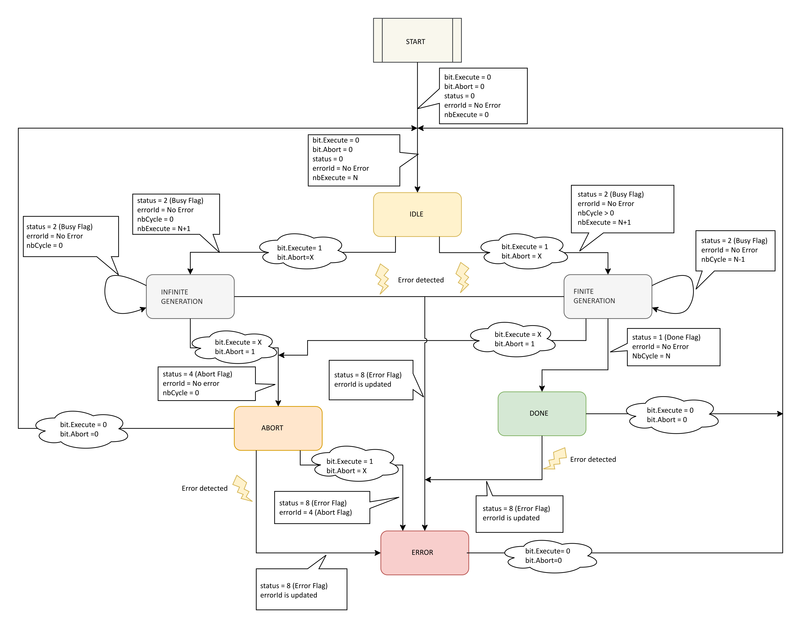

# Operating Mode

## IOM Operating Modes

## Oversampling Output Regarding IOM Operating Modes

| Module Transition to State | Oversampling Input Callback Operations | Oversampling Input Resulting State |
| --- | --- | --- |
| **SYS\_BOOTING** | - | Not configured |
| **SYS\_DEFAULT\_CONF** | - | Not configured |
| **SYS\_CONFIGURED** | Configures Oversampling Output according to the received configuration. | Configured |
| **SYS\_DRIVEN\_OUTPUT** | Operates according to the received data. | Driven\_Operational |
| **SYS\_FALLBACK\_OUTPUT** | Applies the fallback value to the output. | Driven\_Fallback |

## Oversampling Output States

| Oversampling Output State | Oversampling Output Data Exchange | Oversampling Output Status | Oversampling Output Physical Output |
| --- | --- | --- | --- |
| Not configured | - | - | 0 |
| Configured | Produce data: Input image | Status.DoneFlag = FALSE  Status.BusyFlag = FALSE  Status.AbortedFlag = FALSE  Status.ErrorFlag = FALSE  ErrorId = No Error detected  NbExecute = 0 | 0 |
| Driven\_Operational | Receive data: Output image  Produce data: Input image | Refer to [Driven\_Operational](#OperatingMode-C4EFBFC6__Driven_Operational-CEBED6EE). | Oversampling Output value |
| Driven\_Fallback | Produce data: Input image | Status.DoneFlag = FALSE  Status.BusyFlag = FALSE  Status.AbortedFlag = FALSE  Status.ErrorFlag = TRUE  ErrorId = Fallback  NbExecute = No change | Fallback value |

## Driven\_Operational

| Oversampling Output Commands | Condition | Oversampling Output Status | Behavior |
| --- | --- | --- | --- |
| Command.Execute rising edge | No error detected.  Status.AbortedFlag = FALSE. | Status.DoneFlag = FALSE  Status.BusyFlag = TRUE  Status.AbortedFlag = FALSE  Status.ErrorFlag = FALSE  ErrorId = No Error detected  NbExecute = NbExecute + 1 | Output profile generation with OversampledOutputValue.  NbCycle defines if the generation is finite or infinite. |
| - | Finite output profile generation ended. | Status.DoneFlag = TRUE  Status.BusyFlag = FALSE  Status.AbortedFlag = FALSE  Status.ErrorFlag = FALSE  ErrorId = No Error detected  NbExecute = No change | Aborts the output profile generation. |
| Command.Abort rising edge | Output profile generation in progress. | Status.DoneFlag = FALSE  Status.BusyFlag = FALSE  Status.AbortedFlag = TRUE  Status.ErrorFlag = FALSE  ErrorId = No Error detected  NbExecute = No change | Aborts the output profile generation. |
| Command.Execute rising edge | Error detected. | Status.DoneFlag = FALSE  Status.BusyFlag = FALSE  Status.AbortedFlag = FALSE  Status.ErrorFlag = TRUE  ErrorId is updated  NbExecute = NbExecute + 1 | Aborts the output profile generation. |
| - | Error detected.  Output profile generation in progress. | Status.DoneFlag = FALSE  Status.BusyFlag = FALSE  Status.AbortedFlag = FALSE  Status.ErrorFlag = TRUE  ErrorId is updated  NbExecute = No change | Aborts the output profile generation. |
| Command.Execute rising edge | No error detected.  Status.AbortedFlag = TRUE and Status.BusyFlag = FALSE. | Status.DoneFlag = FALSE  Status.BusyFlag = FALSE  Status.AbortedFlag = FALSE  Status.ErrorFlag = TRUE  ErrorId = ABORT\_FLAG  NbExecute = NbExecute + 1 | Aborts the output profile generation. |
| Command.Execute = FALSE | From SYS\_CONFIGURED. | Status.DoneFlag = FALSE  Status.BusyFlag = FALSE  Status.AbortedFlag = FALSE  Status.ErrorFlag = FALSE  ErrorId = No Error detected  NbExecute = No change | Initializes all output flags. |
| Command.Execute = FALSE | Except from SYS\_CONFIGURED. | Status.DoneFlag is updated  Status.BusyFlag is updated  Status.AbortedFlag is updated  Status.ErrorFlag is updated  ErrorId is updated  NbExecute = No change | Maintains all output flags. |
| Command.Execute rising/falling edge | Output profile generation in progress. | - | Ignored. |
| Command.Abort rising edge | No output profile generation. | - | Ignored. |
| Command.Abort falling edge | No output profile generation.  ErrorId = ABORT\_FLAG. | Status.DoneFlag = FALSE  Status.BusyFlag = FALSE  Status.AbortedFlag = FALSE  Status.ErrorFlag = FALSE  ErrorId = No Error detected  NbExecute = No change | Clears the Abort Error flags. |

The following diagram depicts a global view of the Driven\_Operational table:

## ErrorId Priority

| ErrorId | Priority |
| --- | --- |
| Internal Field Power Supply | 0 |
| Short circuit | 1 |
| Fallback | 2 |
| Abort Flag | 3 |

EIO0000005254.00