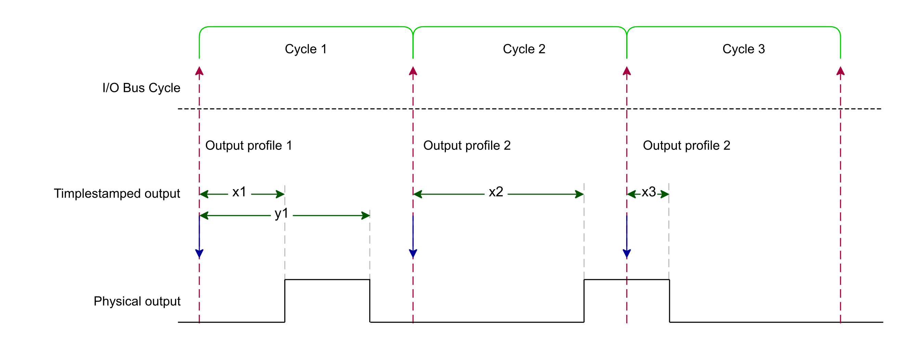

# Principle Diagram

The following diagram depicts an overview of the Timestamp Output mode:

The rising edge and falling edge timestamps are sent to the module each cycle, and the module evaluates in which cycle to apply them. For example, the parameters applied to obtain the diagram above are the following:

|  |  |
| --- | --- |
| Output profile 1 | Command = 7  TimestampOutEdgeRising = x1  TimestampOutEdgeFalling = y1 |
| Output profile 2 | Command = 3  TimestampOutEdgeRising = x2  TimestampOutEdgeFalling = Not relevant |
| Output profile 3 | Command = 5  TimestampOutEdgeRising = Not relevant  TimestampOutEdgeFalling = x3 |

NOTE: Sending a new valid timestamp during generation overwrites the previous one.

EIO0000005254.00