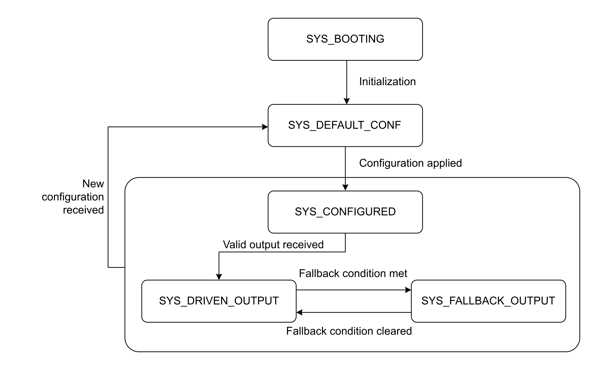

# Operating Mode

## IOM Operating Modes

## Timestamp Output Regarding IOM Operating Modes

| Module Transition to State | Timestamp Output Callback Operations | Timestamp Output Resulting State |
| --- | --- | --- |
| **SYS\_BOOTING** | - | Not configured |
| **SYS\_DEFAULT\_CONF** | - | Not configured |
| **SYS\_CONFIGURED** | Configures Timestamp Output according to the received configuration. | Configured |
| **SYS\_DRIVEN\_OUTPUT** | Operates according to the received data. | Driven\_Operational |
| **SYS\_FALLBACK\_OUTPUT** | Applies fallback value to the output. | Driven\_Fallback |

## Timestamp Output States

| Timestamp Output State | Timestamp Output Data Exchange | Timestamp Output Status | Timestamp Output Physical Output |
| --- | --- | --- | --- |
| Not configured | - | - | 0 |
| Configured | Produce data: Input image | Status.EnabledFlag = FALSE  Status.ErrorFlag = FALSE  ErrorId = No Error detected  Status.WarningRising = FALSE  Status.WarningFalling = FALSE | 0 |
| Driven\_Operational | Receive data: Output image  Produce data: Input image | Refer to [Driven\_Operational](#OperatingMode-C4EFAEE7__Driven_Operational-CEBF0284). | Timestamp output value. |
| Driven\_Fallback | Produce data: Input image | Status.EnabledFlag = FALSE  Status.ErrorFlag = TRUE  ErrorId = Fallback | Fallback value. |

## Driven\_Operational

| Timestamp Output Commands | Condition | Timestamp Output Status | Behavior |
| --- | --- | --- | --- |
| Enable.Generation = TRUE | No error detected | Status.EnabledFlag = TRUE  Status.ErrorFlag = FALSE  ErrorId = No Error detected  Status.WarningRising is updated  Status.WarningFalling is updated | Enables the Timestamp Output mode. NOTE: The TimestampOutEdgeRising and TimestampOutEdgeFalling parameters are applied if respectively:  * Enable.Rising = TRUE * Enable.Falling = TRUE |
| Enable.Generation = TRUE | Error detected | Status.EnabledFlag = FALSE  Status.ErrorFlag = TRUE  ErrorId is updated  Status.WarningRising = No change  Status.WarningFalling = No change | Disables the Timestamp Output mode and the physical output = 0. NOTE: To acknowledge the error and enable the Timestamp Output mode, Enable.Generation must be set to FALSE then to TRUE (after the error condition is removed). |
| Enable.Generation = FALSE | - | Status.EnabledFlag = FALSE  Status.ErrorFlag = FALSE  ErrorId = No Error detected  Status.WarningRising = No change  Status.WarningFalling = No change | Disables the Timestamp Output mode and the physical output = 0. |
| - | WarningAck rising edge | Status.WarningRising = FALSE  Status.WarningFalling = FALSE | Acknowledges advisory flags. |

## ErrorId Priority

| ErrorId | Priority |
| --- | --- |
| Internal Field Power Supply | 0 |
| Short circuit | 1 |
| Fallback | 2 |

EIO0000005254.00