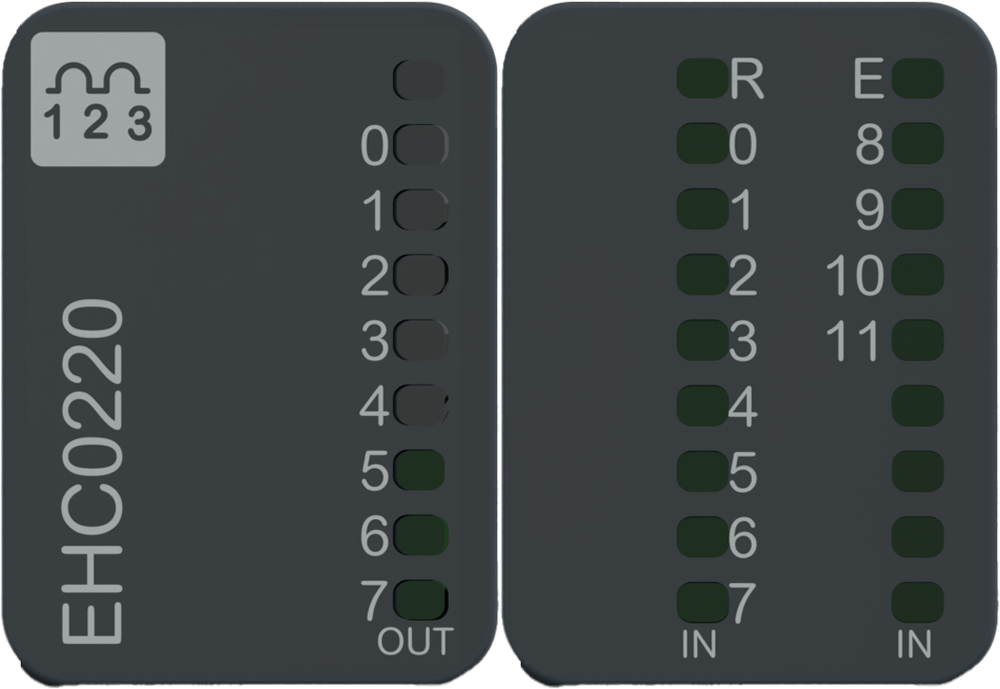

# Status LED

The following figure presents the NTSEHC0220 status LEDs:

The following table describes the status of LEDs:

| R (Green) | E (Red) | Channel  (Green) | Description |
| --- | --- | --- | --- |
| **Initialization and non-operational states** | | | |
| OFF | OFF | OFF | Indicates that the module is not energized. |
| OFF | Fast Flash | - | Indicates that the module has detected a system error. |
| Regular Flash | OFF | - | Indicates that the firmware is being updated. |
| Regular Flash | ON | - | Indicates that a module mismatch is detected. |
| Single Flash | OFF | - | Indicates that the module is energized and not configured. |
| **Operational state** | | | |
| ON | OFF | - | Indicates that the module is energized, configured and operational. |
| ON | - | Regular Flash | When the channel is configured as the PWM Output, it indicates that the frequency generation and duty cycle is between 0.1% and 50%. |
| ON | - | Fast Flash | When the channel is configured as the PWM Output, it indicates that the frequency generation and duty cycle is between 50.1% and 99.9%. |
| ON | - | ON | Indicates that the input or output channel is activated. |
| ON | - | OFF | Indicates that the input or output channel is deactivated.  When the channel is configured as the PWM Output, it indicates that the frequency generation and duty cycle is 0%. |
| ON | Regular Flash | OFF | Indicates that an error is detected in the 24 Vdc field power. |
| ON | Regular Flash | Regular Flash | Indicates that a short circuit is detected on the output. |

The following graphic shows the system status of LEDs during module operation:

EIO0000005262.01