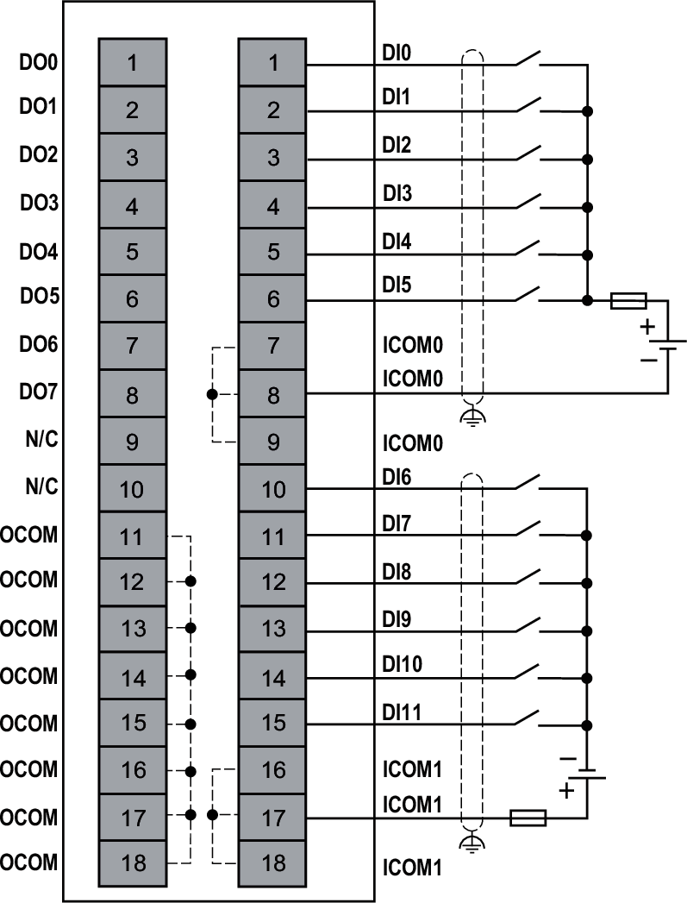
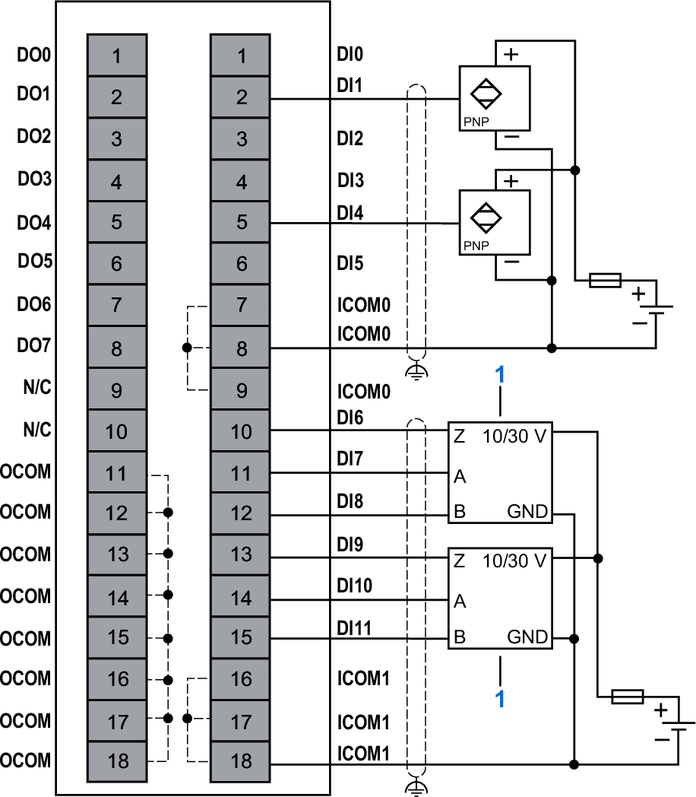
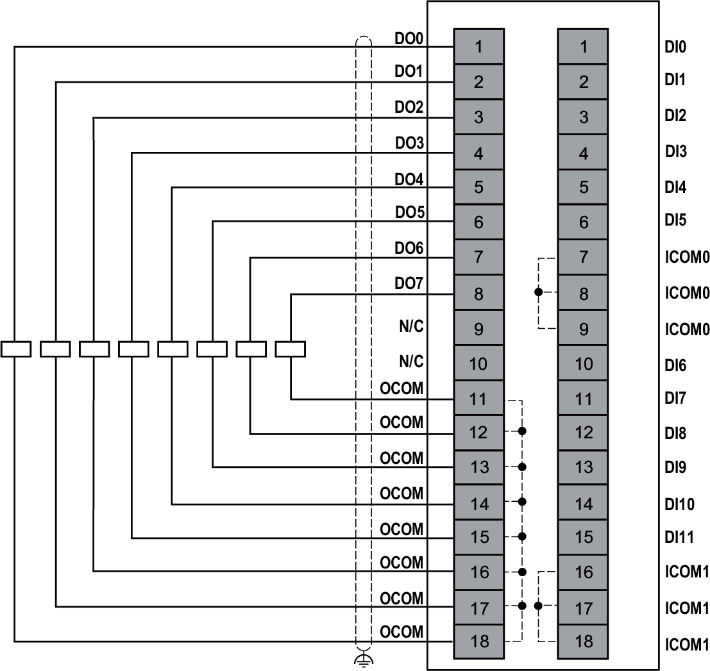

# Wiring Diagrams

Each input channel requires an external 24 Vdc power supply.

| WARNING | |
| --- | --- |
|  | UNINTENDED EQUIPMENT OPERATION  Use the sensor and actuator power supply only for supplying power to sensors or actuators connected to the module.  Failure to follow these instructions can result in death, serious injury, or equipment damage. |

The following figure illustrates the 2-wire sink input and the 2-wire source input connections:

**N/C**: No Connection  
**External Fuse**: Type T, 0.1 A, 250 Vac is mandatory and must be chosen in compliance with IEC60269 standard.

| WARNING | |
| --- | --- |
|  | UNINTENDED EQUIPMENT OPERATION  Do not connect wires to unused terminals and/or terminals indicated as “No Connection (N/C)”.  Failure to follow these instructions can result in death, serious injury, or equipment damage. |

The following figure illustrates the 3-wire input connection and incremental encoder connection:

**1**: Encoder  
**N/C**: No Connection  
**External Fuse**: Type T, 0.1 A, 250 Vac is mandatory and must be chosen in compliance with IEC60269 standard.

| WARNING | |
| --- | --- |
|  | UNINTENDED EQUIPMENT OPERATION  Do not connect wires to unused terminals and/or terminals indicated as “No Connection (N/C)”.  Failure to follow these instructions can result in death, serious injury, or equipment damage. |

The following figure illustrates the source output (push-pull) connection:

**N/C**: No Connection

| WARNING | |
| --- | --- |
|  | UNINTENDED EQUIPMENT OPERATION  Do not connect wires to unused terminals and/or terminals indicated as “No Connection (N/C)”.  Failure to follow these instructions can result in death, serious injury, or equipment damage. |

EIO0000005262.01