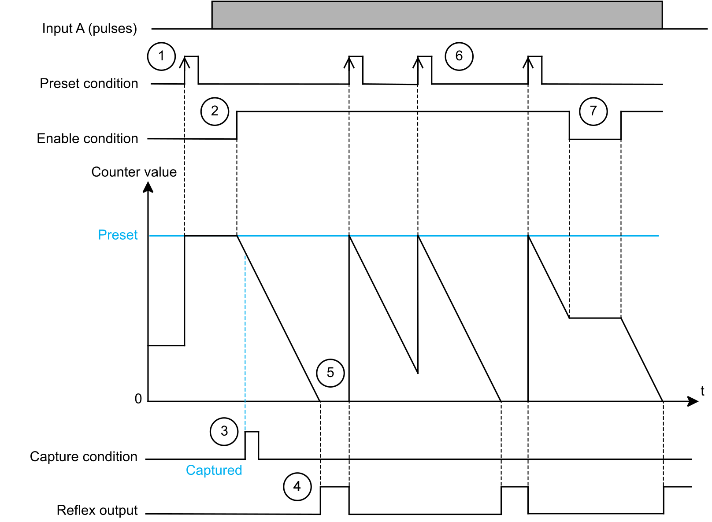
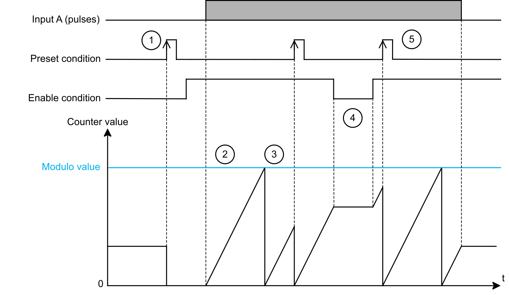

# Single Phase Counting Function

## Description

The Single Phase Counting function operates like the Simple counting function with additional features:

* A 32-bit counting register.
* The [preset condition](PresetSubFunction-FA7D6B9D.html) can be activated with a physical input.
* The [enable condition](EnableFunction-284A99B2.html) can be activated with a physical input.
* A [capture condition](TPC_EdgeIOCaptureFunction-FA79A946.html) that can be activated with a physical input.
* Up to 4 reflex outputs can be configured. For more information about reflex outputs, refer to [Reflex Output Sub-Function](TPC_EDGEIOCountingReflexOutputSubFu-E349278D.html).

The Single Phase Counting function has 2 operating modes:

* One-shot counting
* Modulo-loop counting

The following table describes the features of the Single Phase Counting function:

| Item | Description |
| --- | --- |
| Inputs | The Single Phase Counting function requires a single fast input A Location to operate.  An optional input can be assigned to EN Location, SYNC Location and CAP Location. |
| Counter register | 32 bits |
| Capture register | 32 bits |
| Reflex output | Up to 4 reflex outputs can be configured. For more information about reflex outputs, refer to [Reflex Output Sub-Function](TPC_EDGEIOCountingReflexOutputSubFu-E349278D.html). |
| Maximum input frequency | 250 kHz |
| Counter value update rate | At each pulse on input A. |
| Reflex output state update rate | Depends on the comparison trigger (maximum 20 μs). |

## One-Shot Sub-Mode

In the One-shot sub-mode, the counter value of the function starts at the Preset value and decreases for each pulse on input A.

The following diagram and table describe the One-shot sub-mode principle:

| Stage | Action |
| --- | --- |
| 1 | On the rising edge of the preset condition, the counter value is set to the Preset value and the counter is activated. |
| 2 | While the enable condition is FALSE, the counter does not count the pulses on input A.  While the enable condition is TRUE, the counter value decrements on each pulse on input A until it reaches 0.  NOTE: When the counter value reaches 0, the Run bit is set to 0. |
| 3 | On the rising edge of the capture condition, the counter value is captured into the capture register. |
| 4 | In this example, a reflex output is configured with the Counter STOP condition.  The reflex output is set to TRUE when the counter value is 0. |
| 5 | At this point, pulses on input A have no effect on the counter value. On the rising edge of the preset condition, the counter value is set to the Preset value and the counting resumes.  NOTE: On the rising edge of the preset condition and because enable condition is TRUE, the Run bit is set to 1. |
| 6 | At any time, a rising edge of the preset condition sets the counter value to the Preset value. |
| 7 | When the enable condition is FALSE, the counter ignores the pulses from input A and retains the counting value.  When the enable condition is TRUE, the counter resumes counting pulses from input A. |

## Modulo-Loop Sub-Mode

In the Modulo-loop sub-mode, the counter value of the function starts from 0 and increases for each pulse on input A.

When the value reaches the configured Modulo value - 1, the counter value is set to 0 at the next pulse and the Modulo Flag is set to TRUE.

The following diagram and table describe the Modulo-loop sub-mode principle:

| Stage | Action |
| --- | --- |
| 1 | On the rising edge of the preset condition, the counter value is reset to 0 and the counter is activated. |
| 2 | While the enable condition is TRUE, each pulse on input A increments the counter value. |
| 3 | When the value reaches the configured Modulo value - 1, the counter value is set to 0 at the next pulse and the Modulo Flag is set to TRUE.  NOTE: To reset the Modulo Flag, use the Acknowledge Modulo command. |
| 4 | When the enable condition is FALSE, the counter ignores the pulses from input A and retains its value.  When the enable condition is TRUE, the counter resumes counting pulses from input A. |
| 5 | At any time, a rising edge of the preset condition sets the counter value to 0. |

## Single Phase Counting Configuration

The following table presents the configuration parameters of the Single Phase Counting function:

| Name  *Parameter Name* | Value | Data Type | Description |
| --- | --- | --- | --- |
| Sub Mode  SubMode | 0: One-shot\*  1: Modulo-loop | ENUM | Selects the counting sub-mode. |
| A Location  AInputLocation | 255: Disabled\*  0...5: I0...I5 for NTSEHC0100 and NTSEHC0120H  0...11: I0...I11 for NTSEHC0220 | ENUM | Selects the input used for the A signal. |
| A Filter  AInputFilter | 0: 0  1: 0.0005  2: 0.001  3: 0.002  4: 0.005  5: 0.01  6: 0.05  7: 0.1  8: 0.25  9: 0.5  10: 1  11: 2  12: 4\*  13: 12 | ENUM | Allows reducing the effect of bounce on the input. Changes to the signal are only detected if the pulse width of the input signal is longer than the filter time (ms). |
| A Scaling Factor  AInputScalingFactor | 1\*...255 | BYTE | Sets the number of pulses applied to A Location that are required to increase the counter value by 1.  For example: If the scaling factor is 5, then 5 pulses applied to A Location are required to increase the counter value by 1. |
| EN Location  EnableInputLocation | 255: Disabled\*  0...5: I0...I5 for NTSEHC0100 and NTSEHC0120H  0...11: I0...I11 for NTSEHC0220 | ENUM | Sets the physical input used for the enable function. |
| EN Filter  EnableInputFilter | 0: 0  1: 0.0005  2: 0.001  3: 0.002  4: 0.005  5: 0.01  6: 0.05  7: 0.1  8: 0.25  9: 0.5  10: 1  11: 2  12: 4\*  13: 12 | ENUM | Allows reducing the effect of bounce on the input. Changes to the signal are only detected if the pulse width of the input signal is longer than the filter time (ms). |
| SYNC Location  SyncInputLocation | 255: Disabled\*  0...5: I0...I5 for NTSEHC0100 and NTSEHC0120H  0...11: I0...I11 for NTSEHC0220 | ENUM | Sets the physical input used for the preset function. |
| SYNC Filter  SyncInputFilter | 0: 0  1: 0.0005  2: 0.001  3: 0.002  4: 0.005  5: 0.01  6: 0.05  7: 0.1  8: 0.25  9: 0.5  10: 1  11: 2  12: 4\*  13: 12 | ENUM | Allows reducing the effect of bounce on the input. Changes to the signal are only detected if the pulse width of the input signal is longer than the filter time (ms). |
| Preset Condition  PresetCondition | 0: SYNC Rising Edge\*  1: SYNC Falling Edge  2: SYNC Both Edges | ENUM | Defines how the SYNC Location physical input is triggered. |
| CAP Location  CaptureInputLocation | 255: Disabled\*  0...5: I0...I5 for NTSEHC0100 and NTSEHC0120H  0...11: I0...I11 for NTSEHC0220 | ENUM | Sets the physical input used for the capture function. |
| CAP Filter  CaptureInputFilter | 0: 0  1: 0.0005  2: 0.001  3: 0.002  4: 0.005  5: 0.01  6: 0.05  7: 0.1  8: 0.25  9: 0.5  10: 1  11: 2  12: 4\*  13: 12 | ENUM | Allows reducing the effect of bounce on the input. Changes to the signal are only detected if the pulse width of the input signal is longer than the filter time (ms). |
| Capture Condition  CaptureCondition | 0: Preset\*  1: CAP Rising Edge  2: CAP Falling Edge  3: CAP Both Edges | ENUM | Defines how the CAP Location input is triggered. |
| Preset  Preset(1) | 0...2147483647\* | INT32 | One-shot mode: Sets the counting initial value. |
| Modulo value  Modulo value(1) | 0...2147483647\* | INT32 | Modulo-loop sub-mode: Sets the modulo value at which the counter loops. |
| CAP Window Start  CaptureWindowStartPosition(1) | 0\*...2147483646 | INT32 | Sets the starting value of the capture window.  CAP Window Start<CAP Window End |
| CAP Window End  CaptureWindowEndPosition(1) | 1\*...2147483647 | INT32 | Sets the ending value of the capture window.  CAP Window Start<CAP Window End |
| \* Parameter default value  (1) Online modification is allowed and applied on the rising edge of the preset condition. For more information about online modifications, refer to [Modicon Edge I/O - Configurator and Web Interface - User Guide](../../../../../api/crossBook?lang=en-US&virtualBookName=EdgeIO_Conf_UG&topicID=IslandConfigurationParameters_198E3B92). | | | |

## Implicit Data

The following table presents the input implicit data of the Single Phase Counting function:

| Name  *Parameter Name* | Value | Data Type  Size in Bytes  R/W | Description |
| --- | --- | --- | --- |
| CounterValue | 0...4,294,967,295 | INT32  4  R/- | Counter value.  NOTE: The implicit data CounterValue is updated at each I/O Bus cycle. |
| CaptureValue | 0...4,294,967,295 | INT32  4  R/- | Captured value, valid when Capture Flag is TRUE.  NOTE: The implicit data CaptureValue is updated at each I/O Bus cycle. |
| OperationalState | 0...255 | BYTE  1  R/- | Operational state of the single phase counting function.  Bit 0 (Run), this bit indicates if the counter is active.   * When the enable condition is FALSE. * In One-shot mode, when the counter reaches 0. You must apply a rising edge on the preset condition to run the counter again.   Bit 1 (Valid), this bit indicates if the measurement is valid.   * TRUE when the measurement is within the CounterValue range. * FALSE, when:    + Bit 0 (Run) is FALSE.   + The measurement is not within the CounterValue range.   Bit 2 (Modulo Flag), this bit indicates if the counter looped back to 0 after reaching the modulo value.   * TRUE when the counter loops back to 0. * FALSE on the rising edge of the Acknowledge Modulo Flag bit.   Bit 3 (Preset Flag), this bit indicates if the preset condition bit was set to TRUE.   * TRUE on the rising edge of the preset condition. * FALSE on the rising edge of the Acknowledge Preset Flag bit.   Bit 4 (Capture Flag), this bit indicates if the capture condition was set to TRUE.   * TRUE on the rising edge of the capture condition. * FALSE on the rising edge of the Acknowledge Capture Flag bit.   NOTE: Other bits are reserved. |

The following table presents the output implicit data of the Single Phase Counting function:

| Name  *Parameter Name* | Value | Data Type  Size in Bytes  R/W | Description |
| --- | --- | --- | --- |
| OperationalCommand | 0...65,535 | INT  2  R/W | Bit 0 (Enable): When TRUE, the EN Location physical input can set the enable condition to TRUE.  Bit 1 (Enable Preset): When TRUE, the SYNC Location physical input can set the preset condition to TRUE.  Bit 2 (Enable Capture): When TRUE, the CAP Location physical input can set the capture condition to TRUE.  Bit 3 (Enable Capture Function): When TRUE, enables the capture function.  Bit 4 (Enable Capture Window): When TRUE, the capture condition can be TRUE only if the counter value is within the capture window parameters.  Bit 5 (Enable Compare): When TRUE, the compare function is active.  Bit 6 (Suspend Compare): When TRUE, the compare function is suspended.  Bit 7 (Force Enable): When TRUE, the enable condition is TRUE.  Bit 8 (Force Preset): On a rising edge, the preset condition is TRUE.  Bit 10 (Acknowledge Modulo): On a rising edge, sets the Modulo Flag to FALSE.  Bit 11 (Acknowledge Preset): On a rising edge, sets the Preset Flag to FALSE.  Bit 12 (Acknowledge Capture Flag): On a rising edge, sets the Capture Flag to FALSE.  NOTE: Other bits are reserved. |

EIO0000005262.01