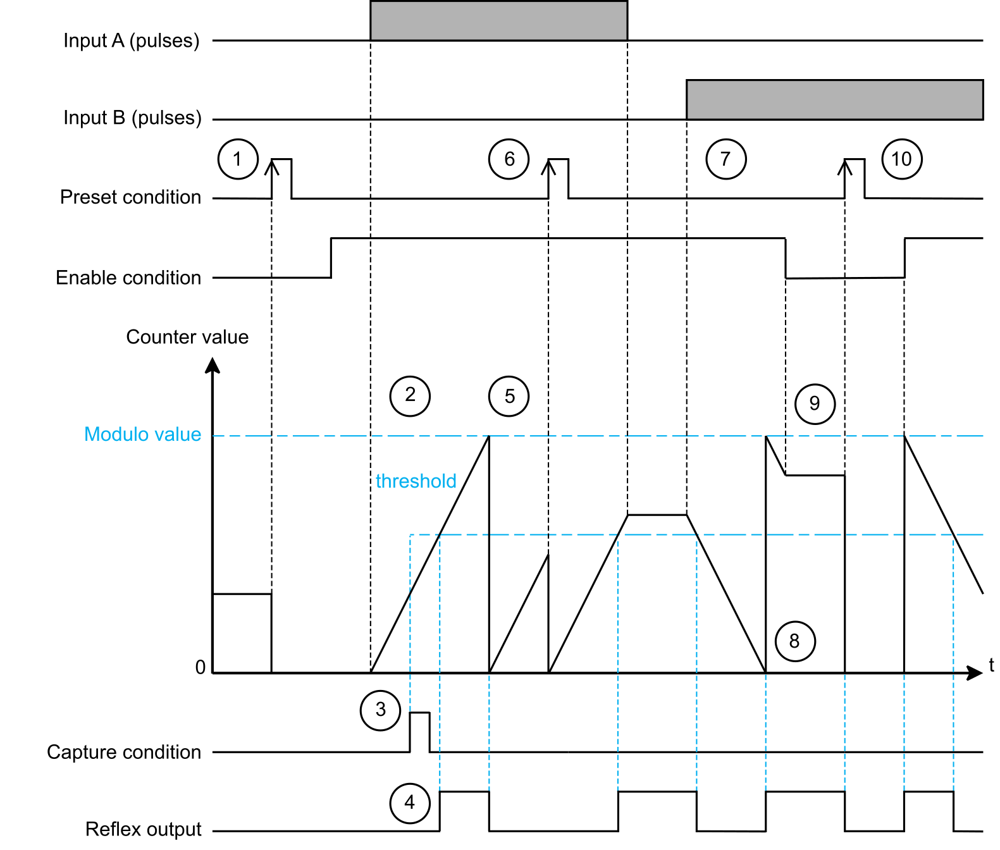
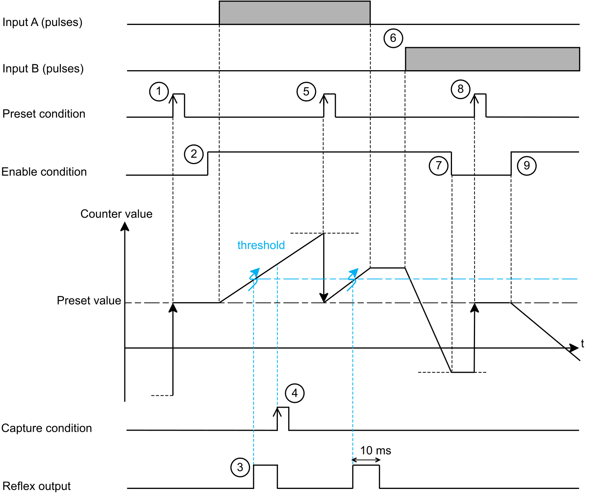

# Dual Phase Counting Function

## Description

The Dual Phase Counting function operates like the Simple counting function with additional features:

* A 32-bit counting register.
* Two inputs A and B for positive or negative counting.
* The [preset condition](PresetSubFunction-FA7D6B9D.html) can be activated with a physical input.
* The [enable condition](EnableFunction-284A99B2.html) can be activated with a physical input.
* A [capture condition](TPC_EdgeIOCaptureFunction-FA79A946.html) that can be activated with a physical input.
* Up to 4 reflex outputs can be configured. For more information about reflex outputs, refer to [Reflex Output Sub-Function](TPC_EDGEIOCountingReflexOutputSubFu-E349278D.html).

The Dual Phase Counting function has 2 operating modes:

* Modulo-loop counting
* Free-large counting

The following table describes the features of the Dual Phase Counting function:

| Item | Description |
| --- | --- |
| Inputs | The Dual Phase Counting function requires two fast inputs A Location and B Location to operate.  An optional input can be assigned to EN Location, SYNC Location and CAP Location. |
| Counter register | 32 bits |
| Capture register | 32 bits |
| Reflex Output | Up to 4 reflex outputs can be configured. For more information about reflex outputs, refer to [Reflex Output Sub-Function](TPC_EDGEIOCountingReflexOutputSubFu-E349278D.html). |
| Maximum input frequency | 250 kHz |
| Counter update rate | At each pulse on inputs A or B. |
| Reflex output update rate | Depends on the comparison trigger (maximum 20 μs). |

## Modulo-Loop Sub-Mode

In the Modulo-loop sub-mode, the output value of the function starts from 0.

When the value reaches the configured Modulo value - 1, the counter value is set to 0 at the next pulse and the Modulo Flag is set to TRUE.

The counter can count up and down according to the input mode used. For more information about the input modes, refer to [Input modes](#TPC_EDGEIODualPhaseCountingFunction-E348FA7A__InputModes-2B6BC6B4).

The following diagram and table describe an example on how a dual phase counter operates in Modulo-loop mode with an input mode configured as A = UP and B = DOWN:

| Stage | Action |
| --- | --- |
| 1 | On the rising edge of the preset condition, the counter value is set to 0 and the counter is activated. |
| 2 | While the enable condition is TRUE, each pulse on input A increments the counter value. |
| 3 | On the rising edge of the capture condition, the counter value is captured into the capture register. |
| 4 | In this example, a reflex output is configured with the Counter Within Threshold condition:   * The Reflex Condition: Counter Within Threshold value is 2. * Threshold 0 is the threshold value in the graphic. * Threshold 1 is set at the Modulo value value.   The reflex output is set to TRUE when the counter value is above the threshold value. |
| 5 | When the value reaches the configured Modulo value - 1, the counter value is set to 0 at the next pulse and the Modulo Flag is set to TRUE.  The reflex output is set to FALSE when the counter value is below the threshold value.  NOTE: To reset the Modulo Flag use the Acknowledge Modulo command. |
| 6 | At any time, a rising edge of the preset condition sets the counter value to 0. |
| 7 | While the enable condition is TRUE, each pulse on input B decreases the counter value. |
| 8 | When the value reaches 0, the counter value is set to the configured Modulo value - 1 at the next pulse and the Modulo Flag is set to TRUE.  The reflex output is set to TRUE when the counter value is below the threshold value.  NOTE: To reset the Modulo Flag use the Acknowledge Modulo command. |
| 9 | When the enable condition is FALSE, the counter ignores the pulses from input B and retains its value.  When the enable condition is TRUE, the counter resumes counting pulses from input B. |
| 10 | At any time, a rising edge of the preset condition sets the counter value to 0.  The reflex output is set to FALSE when the counter value is below the threshold value. |

## Free-Large Sub-Mode

In the Free-large sub-mode, the counter value starts at the value of the Preset parameter and counts up and down depending on the input mode used. For more information about the input modes, refer to [Input modes](#TPC_EDGEIODualPhaseCountingFunction-E348FA7A__InputModes-2B6BC6B4).

The following diagram shows an example on how a dual phase counter operates in Free-large sub-mode with an input mode configured as A = UP and B = DOWN:

| Stage | Action |
| --- | --- |
| 1 | On the rising edge of the preset condition, the counter value is set to the Preset value and the counter is activated. |
| 2 | While the enable condition is TRUE, each pulse on input A increments the counter value. |
| 3 | In this example, a reflex output is configured with the Counter Cross Threshold Upwards condition.  The reflex output is set to TRUE when the counter value crosses the threshold value for a duration defined by the Reflex: Pulse Width parameter.  In this example, Reflex: Pulse Width is set to 10 ms. |
| 4 | On the rising edge of the capture condition, the counter value is captured into the capture register. |
| 5 | At any time, a rising edge of the preset condition sets the counter value to the Preset value. |
| 6 | While the enable condition is TRUE, each pulse on input B decreases the counter value. |
| 7 | When the enable condition is FALSE, the counter ignores the pulses from input B and retains its value.  When the enable condition is TRUE, the counter resumes counting pulses from input B. |
| 8 | At any time, a rising edge of the preset condition sets the counter value to the Preset value. |
| 9 | While the enable condition is TRUE, each pulse on input B decreases the counter value. |

## Input modes

The following table presents the 8 types of input modes available:

| Input Mode | Comment |
| --- | --- |
| A = Up, B = Down | Default mode  The counter increments on A and decrements on B. |
| A = Pulse, B = Direction | If there is a rising edge on A and B is TRUE, then the counter decrements.  If there is a rising edge on A and B is FALSE, then the counter increments. |
| Normal Quadrature X1 | A physical encoder provides 2 signals with a 90° shift that allows the counter to count pulses and detect direction:   * X1: 1 count for each encoder cycle. * X2: 2 counts for each encoder cycle. * X4: 4 counts for each encoder cycle.   The encoder signal is counted according to the input mode selected as follows: |
| Normal Quadrature X2 |
| Normal Quadrature X4 |
| Reverse Quadrature X1 |
| Reverse Quadrature X2 |
| Reverse Quadrature X4 |

## Dual Phase Counting Configuration

This following table presents the configuration parameters of the Dual Phase Counting function:

| Name  *Parameter Name* | Value | Data Type | Description |
| --- | --- | --- | --- |
| Sub Mode  SubMode | 0: Modulo-loop\*  1: Free-large | ENUM | Selects the counting sub-mode. |
| Input Mode  InputMode | 0: A = UP, B = DOWN\*  1: A = Pulse, B = Direction  2: Normal Quadrature X1  3: Normal Quadrature X2  4: Normal Quadrature X4  5: Reverse Quadrature X1  6: Reverse Quadrature X2  7: Reverse Quadrature X4 | ENUM | Selects the input mode. |
| A Location  AInputLocation | 255: Disabled\*  0...5: I0...I5 for NTSEHC0100 and NTSEHC0120H  0...11: I0...I11 for NTSEHC0220 | ENUM | Selects the input used for the A signal. |
| A Filter  AInputFilter | 0: 0  1: 0.0005  2: 0.001  3: 0.002  4: 0.005  5: 0.01  6: 0.05  7: 0.1  8: 0.25  9: 0.5  10: 1  11: 2  12: 4\*  13: 12 | ENUM | Allows reducing the effect of bounce on the input. Changes to the signal are only detected if the pulse width of the input signal is longer than the filter time (ms). |
| B Location  AInputLocation | 255: Disabled\*  0...5: I0...I5 for NTSEHC0100 and NTSEHC0120H  0...11: I0...I11 for NTSEHC0220 | ENUM | Selects the input used for the B signal |
| B Filter  AInputFilter | 0: 0  1: 0.0005  2: 0.001  3: 0.002  4: 0.005  5: 0.01  6: 0.05  7: 0.1  8: 0.25  9: 0.5  10: 1  11: 2  12: 4\*  13: 12 | ENUM | Allows reducing the effect of bounce on the input. Changes to the signal are only detected if the pulse width of the input signal is longer than the filter time (ms). |
| Scaling Factor  ScalingFactor | 1\*...255 | BYTE | Sets the number of pulses applied to A Location and B Location that are required to increase the counter value by 1.  For example: If the scaling factor is 5, then 5 pulses applied to A Location or B Location are required to increase the counter value by 1. |
| EN Location  EnableInputLocation | 255: Disabled\*  0...5: I0...I5 for NTSEHC0100 and NTSEHC0120H  0...11: I0...I11 for NTSEHC0220 | ENUM | Sets the physical input used for the enable function. |
| EN Filter  EnableInputFilter | 0: 0  1: 0.0005  2: 0.001  3: 0.002  4: 0.005  5: 0.01  6: 0.05  7: 0.1  8: 0.25  9: 0.5  10: 1  11: 2  12: 4\*  13: 12 | ENUM | Allows reducing the effect of bounce on the input. Changes to the signal are only detected if the pulse width of the input signal is longer than the filter time (ms). |
| SYNC Location  SyncInputLocation | 255: Disabled\*  0...5: I0...I5 for NTSEHC0100 and NTSEHC0120H  0...11: I0...I11 for NTSEHC0220 | ENUM | Sets the physical input used for the preset function. |
| SYNC Filter  SyncInputFilter | 0: 0  1: 0.0005  2: 0.001  3: 0.002  4: 0.005  5: 0.01  6: 0.05  7: 0.1  8: 0.25  9: 0.5  10: 1  11: 2  12: 4\*  13: 12 | ENUM | Allows reducing the effect of bounce on the input. Changes to the signal are only detected if the pulse width of the input signal is longer than the filter time (ms). |
| Preset Condition  PresetCondition | 0: SYNC Rising Edge\*  1: SYNC Falling Edge  2: SYNC Both Edges | ENUM | Defines how the SYNC Location physical input triggers a preset condition. |
| CAP Location  CaptureInputLocation | 255: Disabled\*  0...5: I0...I5 for NTSEHC0100 and NTSEHC0120H  0...11: I0...I11 for NTSEHC0220 | ENUM | Sets the physical input used for the capture function. |
| CAP Filter  CaptureInputFilter | 0: 0  1: 0.0005  2: 0.001  3: 0.002  4: 0.005  5: 0.01  6: 0.05  7: 0.1  8: 0.25  9: 0.5  10: 1  11: 2  12: 4\*  13: 12 | ENUM | Allows reducing the effect of bounce on the input. Changes to the signal are only detected if the pulse width of the input signal is longer than the filter time (ms). |
| Capture Condition  CaptureCondition | 0: Preset\*  1: CAP Rising Edge  2: CAP Falling Edge  3: CAP Both Edges | ENUM | Defines how the CAP Location physical input is triggered. |
| Limits  LimitManagement | 0: Lock on limits\*  1: Rollover | ENUM | In Free-large sub-mode, this parameter defines the behavior when the counter reaches the lower or upper limit:   * Lock on limits: When the counter value reaches the lower or upper limit, the Run bit is set to FALSE and the counter value is maintained. You must apply a rising edge on the preset condition to run the counter again. * Rollover: When the counter value reaches the lower or upper limit, the counter rolls over to the opposite limit.   NOTE: In Free-large sub-mode, the lower and upper limit values are -2,147,483,648...2,147,483,647. |
| Modulo value  Modulo value(1) | 0...2147483647\* | SINT32 | In Modulo-loop sub-mode, sets the modulo value at which the counter loops. |
| Preset  Preset(1) | -2147483648...2147483647\* | SINT32 | In Free-large sub-mode, sets the initial counter value on the rising edge of the preset condition. |
| Hysteresis  Hysteresis(1) | -128...127  0\* | SBYTE | Sets the number of pulses that are not taken into account when changing the direction of counting. |
| CAP Window Start  CaptureWindowStartPosition(1) | 0...2147483646 (Modulo-loop)  -2147483648...2147483646 (Free-large)  0\* | SINT32 | Sets the starting value of the capture window.  CAP Window Start<CAP Window End |
| CAP Window End  CaptureWindowEndPosition(1) | 1...2147483647 (Modulo-loop)  -2147483647...2147483647 (Free-large)  1\* | SINT32 | Sets the ending value of the capture window.  CAP Window End>CAP Window Start |
| \* Parameter default value  (1) Online modification is allowed and applied on the rising edge of the preset condition. For more information about online modifications, refer to [Modicon Edge I/O - Configurator and Web Interface - User Guide](../../../../../api/crossBook?lang=en-US&virtualBookName=EdgeIO_Conf_UG&topicID=IslandConfigurationParameters_198E3B92). | | | |

## Implicit Data

The following table presents the input implicit data of the Dual Phase Counting function:

| Name  *Parameter Name* | Value | Data Type  Size in Bytes | Description |
| --- | --- | --- | --- |
| CounterValue | 0...2,147,483,647\* (Modulo-loop)  -2,147,483,648...2,147,483,646 (Free-large) | SINT32  4 | Dual phase value.  NOTE: The implicit data CounterValue is updated at each I/O Bus cycle. |
| CaptureValue | 0...2,147,483,647\* (Modulo-loop)  -2,147,483,648...2,147,483,646 (Free-large) | SINT32  4 | Captured value, valid when capture flag is TRUE.  NOTE: The implicit data CaptureValue is updated at each I/O Bus cycle. |
| OperationalState | 0...255 | BYTE  1 | Operational state of the dual phase counting function.  Bit 0 (Run), this bit indicates if the counter is active.   * TRUE when the enable condition is TRUE. * FALSE:   + When the enable condition is FALSE.   + In Free-large mode, when the counter reaches the lower or upper limit. You must apply a rising edge on the preset condition to run the counter again.   Bit 1 (Valid), this bit indicates if the measurement is valid.   * TRUE when the measurement is within the CounterValue range. * FALSE, when:    + Bit 0 (Run) is FALSE.   + The measurement is not within the CounterValue range.   Bit 2 (Modulo Flag), this bit indicates if the counter looped back to 0 after reaching the modulo value.   * TRUE when the counter loops back to 0. * FALSE on the rising edge of the Acknowledge Modulo Flag bit.   Bit 3 (Preset Flag), this bit indicates if the preset condition bit was set to TRUE.   * TRUE on the rising edge of the preset condition. * FALSE on the rising edge of the Acknowledge Preset Flag bit.   Bit 4 (Capture Flag), this bit indicates if the capture condition was set to TRUE.   * TRUE on the rising edge of the capture condition. * FALSE on the rising edge of the Acknowledge Capture Flag bit.   NOTE: Other bits are reserved. |

The following table presents the output implicit data of the Dual Phase Counting function:

| Name  *Parameter Name* | Value | Data Type  Size in Bytes | Description |
| --- | --- | --- | --- |
| OperationalCommand | 0...65,535 | INT  2 | Bit 0 (Enable): When TRUE, the EN Location physical input can set the enable condition to TRUE.  Bit 1 (Enable Preset): When TRUE, the SYNC Location physical input can set the preset condition to TRUE.  Bit 2 (Enable Capture): When TRUE, the CAP Location physical input can set the capture condition to TRUE.  Bit 3 (Enable Capture Function): When TRUE, enables the capture function.  Bit 4 (Enable Capture Window): When TRUE, the capture condition can be TRUE only if the counter value is within the configured capture window.  Bit 5 (Enable Compare): When TRUE, the compare function is active.  Bit 6 (Suspend Compare): When TRUE, the compare function is suspended.  Bit 7 (Force Enable): When TRUE, the enable condition is TRUE.  Bit 8 (Force Preset): On a rising edge, the preset condition is TRUE.  Bit 10 (Acknowledge Modulo): On a rising edge, sets the Modulo Flag to FALSE.  Bit 11 (Acknowledge Preset): On a rising edge, sets the Preset Flag to FALSE.  Bit 12 (Acknowledge Capture Flag): On a rising edge, sets the Capture Flag to FALSE.  NOTE: Other bits are reserved. |

EIO0000005262.01