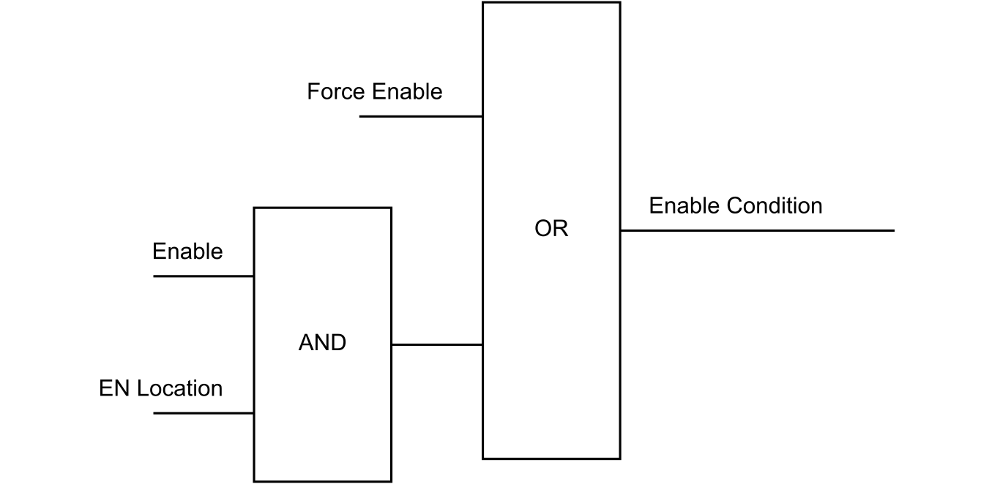

# Enable Function

Each counting function has an Enable Function that allows the counter to operate.

The Enable Function is activated by the enable condition which operates as shown in the following diagram:

**Force Enable**: OperationalCommand bit 7.  
**Enable**: OperationalCommand bit 0.  
**EN Location**: Physical input assigned to the EN Location parameter.

NOTE: With the Simple counting function, the enable condition is operated with the OperationalCommand bit 0.

EIO0000005262.01