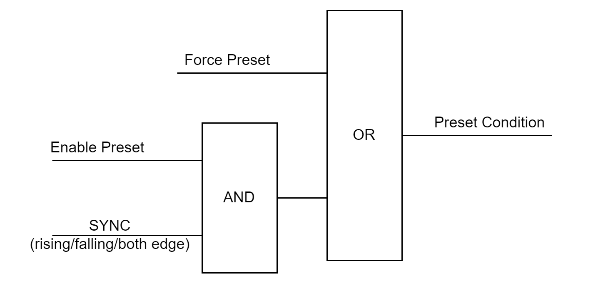

# Preset Function

Each function has a Preset Function used to set, reset, or initialize the operation.

The Preset Function is activated by a rising edge of the preset condition which operates as shown on the following diagram:

**Force Preset**: OperationalCommand bit 8.  
**Enable Preset**: OperationalCommand bit 1.  
**SYNC**: Physical input assigned to the SYNC Location parameter.  
**Rising / falling / both edge**: Preset Condition parameter setting.

NOTE: With the Simple counting function, the preset condition is operated with the OperationalCommand bit 1.

EIO0000005262.01