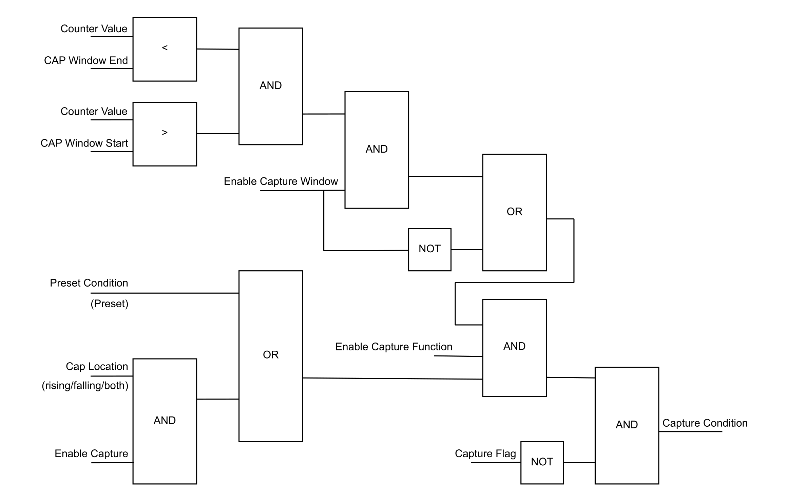

# Capture Function

The Capture Function stores the counter value in the capture register.

The Capture Function is activated when the capture condition is TRUE which operates as shown in the following diagram:

**Enable Capture**: OperationalCommand bit 2.  
**Enable Capture Function**: OperationalCommand bit 3.  
**Enable Capture Window**: OperationalCommand bit 4.  
**Capture Flag**: OperationalState bit 4.  
**CAP Window Start**: Value of the CAP Window Start parameter.  
**CAP Window End**: Value of the CAP Window End parameter.  
**Preset/rising/fall/both edge**: Capture Condition parameter setting.

EIO0000005262.01