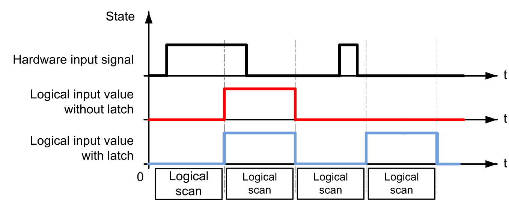
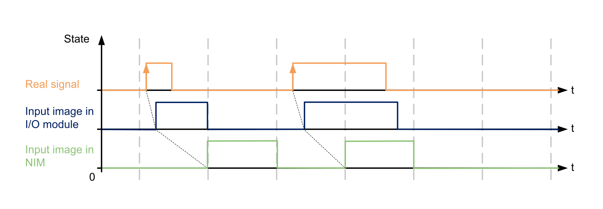
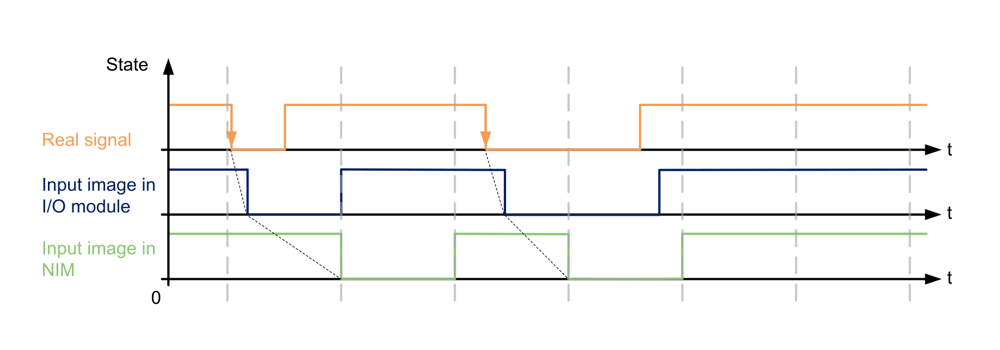
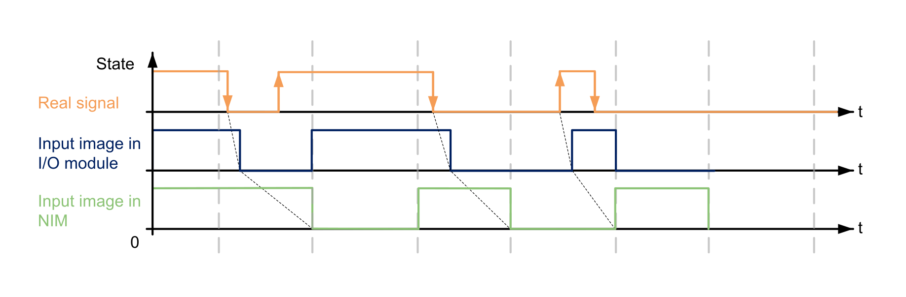
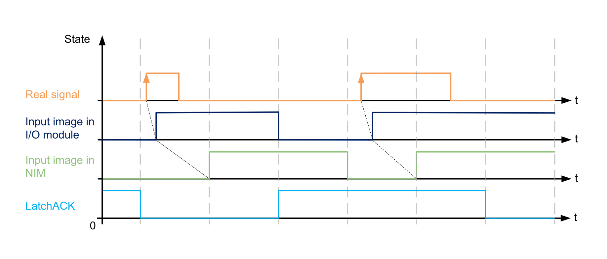
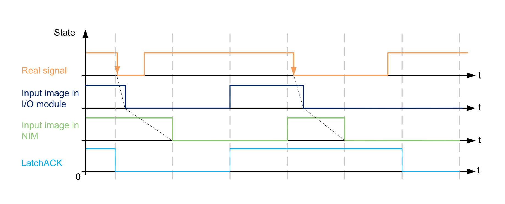
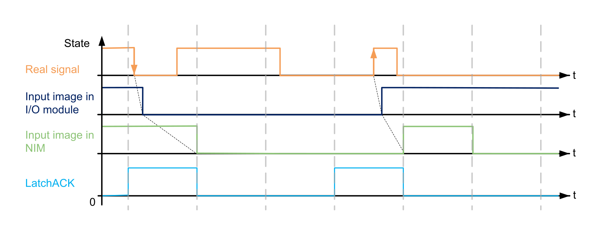

# Input Latch

## Overview

The Latch parameter allows incoming pulses with a pulse width shorter than the network interface module scan time to be captured and recorded as depicted in the following diagram:

The shortest input pulse detected is determined by the bounce filter time.

A pulse can be captured either on a rising edge, a falling edge or on both edges. An acknowledge action is necessary before a new latch value can be captured.

## Automatic Acknowledge

A rising edge on the LatchAck is done at each I/O bus cycle.

The following diagrams depicts the behavior of the input image in automatic acknowledge:

Rising Edge - Automatic Acknowledge:

Falling Edge - Automatic Acknowledge:

Both Edges - Automatic Acknowledge:

## Manual Acknowledge

When an input value is latched, the input image in the I/O module is maintained at the latched value and a new value cannot be latched.

On a rising edge of the LatchAck bit, the input image in the I/O module is no longer maintained and a new value can be latched.

The following diagrams depict the behavior of the input image in manual acknowledge:

Rising Edge - Manual Acknowledge:

Falling Edge - Manual Acknowledge:

Both Edges - Manual Acknowledge:

EIO0000005262.01