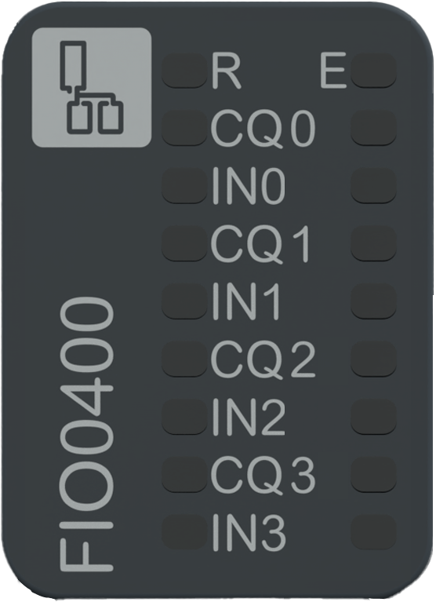

# Status LEDs

The following figure presents the NTSFIO0400 status LEDs:

The following table describes the status of LEDs:

| R (Green) | E (Red) | CQ0...3 (Green / Red / Yellow) | IN0...3 (Green) | Description |
| --- | --- | --- | --- | --- |
| **Initialization and non-operational states** | | | | |
| OFF | OFF | OFF | OFF | Indicates that the module is not energized. |
| OFF | Fast Flash | - | - | Indicates that the module has detected a system error. |
| Regular Flash | OFF | - | - | Indicates that the firmware is being updated. |
| Regular Flash | ON | - | - | Indicates that a module mismatch is detected. |
| Single Flash | OFF | - | - | Indicates that the module is energized and not configured. |
| **Operational state** | | | | |
| ON | OFF | OFF | - | Indicates that the discrete input or output is deactivated.(1) |
| ON | OFF | Green ON | - | Indicates that the discrete input or output is activated.(1) |
| ON | OFF | Yellow ON | - | Indicates an active IO-Link communication.(2) |
| ON | Regular Flash | - | - | Indicates that a channel-related error is detected or the module is in fallback state. |
| ON | Regular Flash | Red Regular Flash | - | Indicates that a configured IO-Link device is not connected.(2) |
| ON | Regular Flash | Red ON | - | Indicates that a channel-related error is detected, for instance:(2)   * Indicates an undervoltage detection. * Indicates an overload detection. * Indicates an internal error detection. * Indicates that the configured IO-Link device does not match the device connected. |
| ON | ON | - | - | Indicates that a module-related error is detected. |
| ON | - | - | OFF | Indicates that the discrete input is deactivated.(3) |
| ON | - | - | ON | Indicates that the discrete input is activated.(3) |
| (1) Relevant if Port Mode and CQ behavior is set to SIO input Mode or SIO output Mode.  (2) Relevant if Port Mode and CQ behavior is set to Manual Mode or Autostart Mode.  (3) Relevant if IQ Behavioris set to Digital input. | | | | |

NOTE: For an extended diagnostic, refer to the [Modicon Edge I/O - Diagnostic Data - User Guide](../../EdgeIO_Diag_UG)

The following graphic shows the system status of LEDs during module operation:

EIO0000005270.01