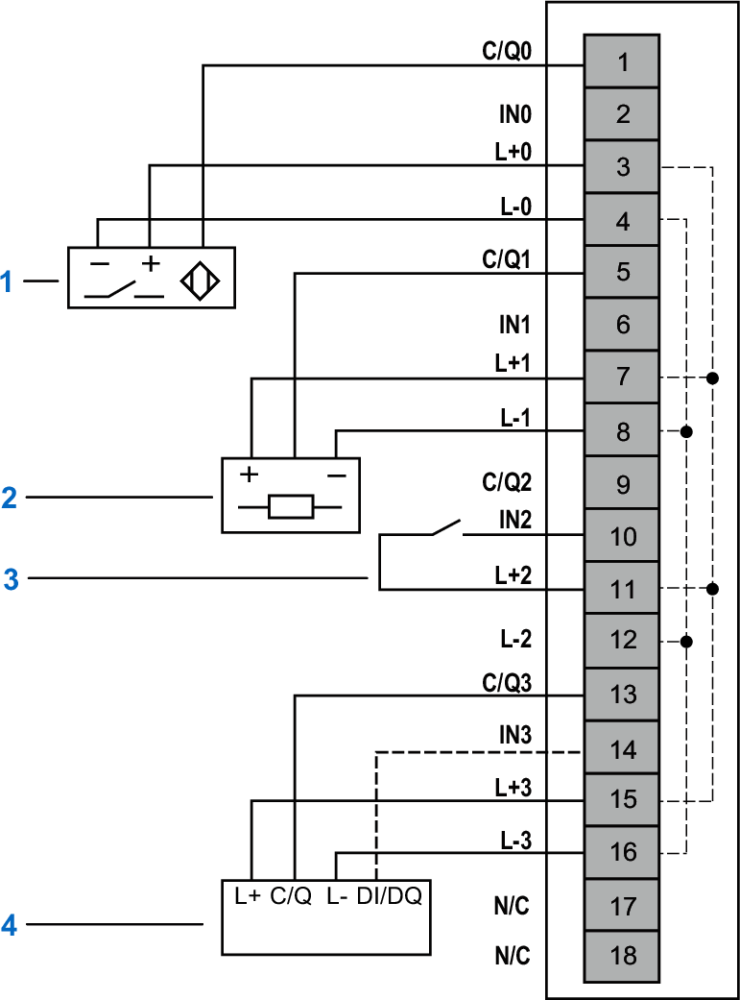
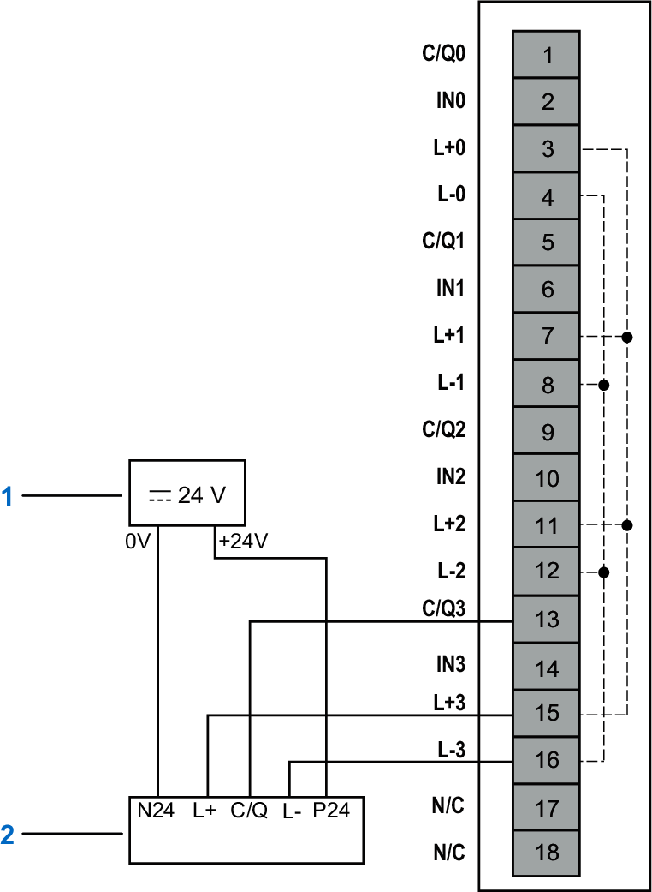

# Wiring Diagrams

This module allows the use of an external power supply to energize the sensors.

| WARNING | |
| --- | --- |
|  | UNINTENDED EQUIPMENT OPERATION  Use the sensor and actuator power supply only for supplying power to sensors or actuators connected to the module.  Failure to follow these instructions can result in death, serious injury, or equipment damage. |

## NTSFIO0400 Wiring diagram IO-Link Class A

The following figure illustrates the connections of the IO-Link device (Class A):

**1**: 3-wire sensor  
**2**: 3-wire actuator  
**3**: Discrete input  
**4**: IO-Link device (Class A) (4 wires)  
**N/C**: No Connection

| WARNING | |
| --- | --- |
|  | UNINTENDED EQUIPMENT OPERATION  Do not connect wires to unused terminals and/or terminals indicated as “No Connection (N/C)”.  Failure to follow these instructions can result in death, serious injury, or equipment damage. |

## NTSFIO0400 Wiring diagram IO-Link Class B with external power supply

The following figure illustrates the connections of the IO-Link device (Class B):

**1**: SELV External power supply isolated from field power  
**2**: IO-Link device (Class B) (M12)  
**N/C**: No Connection

| WARNING | |
| --- | --- |
|  | UNINTENDED EQUIPMENT OPERATION  Do not connect wires to unused terminals and/or terminals indicated as “No Connection (N/C)”.  Failure to follow these instructions can result in death, serious injury, or equipment damage. |

EIO0000005270.01