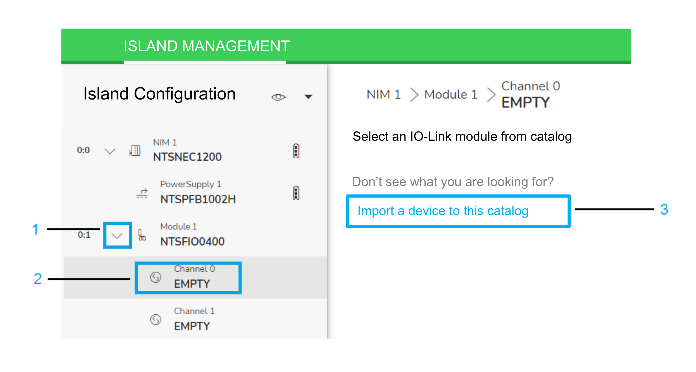
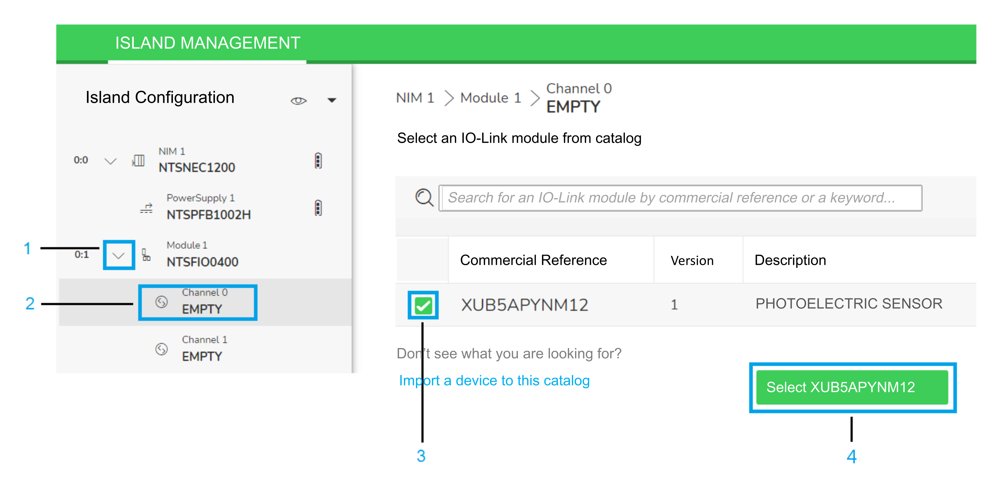

# IO-Link Device IODD Import and Selection

## Overview

The Modicon Edge I/O Configurator software and the embedded Modicon Edge I/O NTS Web Interface allow you to import the IO-Link device IODD description files for configuration creation or management.

## IODD Description Files Import to the Catalog

This submenu allows you to import IO-Link device IODD description files:

| Step | Action |
| --- | --- |
| 1 | In the Island Configuration, expand the list to display the channels of the selected module. |
| 2 | Click the Channel. |
| 3 | Click Import a device to this catalog.  Result: The Windows Open dialog box is displayed. |
| 4 | Navigate to the file location and select the IO-Link device IODD description file from your local PC or server. Click Open to confirm the selection. |

## Add an IO-Link Device

This submenu allows you to add the IO-Link device:

| Step | Action |
| --- | --- |
| 1 | In the Island Configuration, expand the list to display the channels of the selected module. |
| 2 | Click the Channel  to be configured. |
| 3 | Select the check box for the IO-Link device to be added to the Channel. |
| 4 | Confirm using the Select button. |

## Device Configuration

After the IO-Link device is imported and added, configure the device parameters of the channel.

| Step | Action |
| --- | --- |
| 1 | In the Island Configuration, expand the list to display the channels of the selected module. |
| 2 | Click the Channel of the device to be configured. The device parameters are displayed, according to the IODD content. |
| 3 | Configure the device parameters. NOTE: Parameters that are not modified are displayed with the value Unset.  If you are configuring your device offline, proceed to step 4 only.  If you are configuring your device online, skip step 4 and proceed directly to step 5. |
| 4 | The following actions are possible while being offline:   * Configure the device parameters by modifying the value. For more information on possible settings, refer to the device documentation. * The Set to default drop-down list allows you to select one of the following actions:   + All parameters: All parameters are set to the default values defined in the IODD.   + Unset parameters: Parameters that are not modified are set to the default value defined in the IODD. Configured parameters are not modified. * The Unset parameters button allows you to set the device parameters to Unset. |
| 5 | The following actions are possible while being online:   * The Read Values button allows you to read the values configured in the connected device. Two lists of parameters are displayed:   + PARAMETERS: Parameters that are accessible offline and online.   + ONLINE PARAMETERS: Parameters that are accessible only online. * Configure the device parameters by entering or selecting the value. For parameters which type is ButtonT, you can send a command by clicking the corresponding button. For more information on possible settings, refer to the device documentation.    + To write a parameter value to the device, click  Write online value icon.   + To read a parameter value from the device, click  Read online value icon.   NOTE: Some IO-Link devices restart when a parameter has been written online. This may lead to an unsuccessful writing if another parameter is written before the restart of the device has completed as the IO-Link device is not accessible.  NOTE: If Validation and Backup is set to 3 (Compatible with IO-Link V1.1, datastorage set as backup and restore), the parameters may not be updated as intended.   | WARNING | | | --- | --- | |  | UNINTENDED EQUIPMENT OPERATION  Verify that the writing of parameters to the IO-Link devices is successfully completed.  Failure to follow these instructions can result in death, serious injury, or equipment damage. | |

EIO0000005270.01