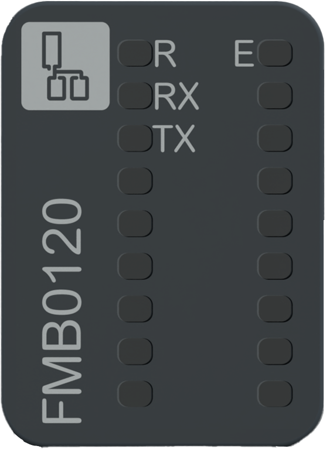
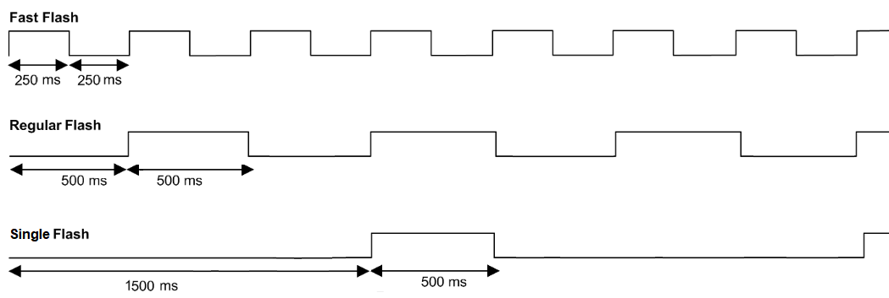

# Status LEDs

The following figure presents the NTSFMB0120/NTSFMB0120H status LEDs:

The following table describes the status of LEDs:

| R (Green) | E (Red) | RX, TX (Green) | Description |
| --- | --- | --- | --- |
| **Initialization and non-operational states** | | | |
| OFF | OFF | OFF | Indicates that the module is not energized. |
| OFF | ON | - | Indicates that the module has detected a system error. |
| Regular Flash | OFF | - | Indicates that the firmware is being updated. |
| Regular Flash | ON | - | Indicates that a module mismatch is detected. |
| Single Flash | OFF | - | Indicates that the module is energized and not configured. |
| **Operational state** | | | |
| ON | OFF | - | Indicates that the module is energized, configured and operational. |
| Fast Flash | - | - | Indicates that the Modbus I/O scanner is stopped. |
| ON | Regular Flash | - | Indicates an advisory detection. |
| ON | Regular Flash | OFF | Indicates that a 24 Vdc field power error is detected. |
| ON | Regular Flash | Regular Flash | Indicates that the module is in fallback state. |
| ON | ON | - | Indicates that a module-related error is detected. |
| ON | OFF | Fast Flash | Indicates an activity on the serial line port:   * RX: receive * TX: transmit |

NOTE: For an extended diagnostic, refer to the [Modicon Edge I/O - Diagnostic Data - User Guide](../../EdgeIO_Diag_UG)

The following graphic shows the system status of LEDs during module operation:

EIO0000005270.01