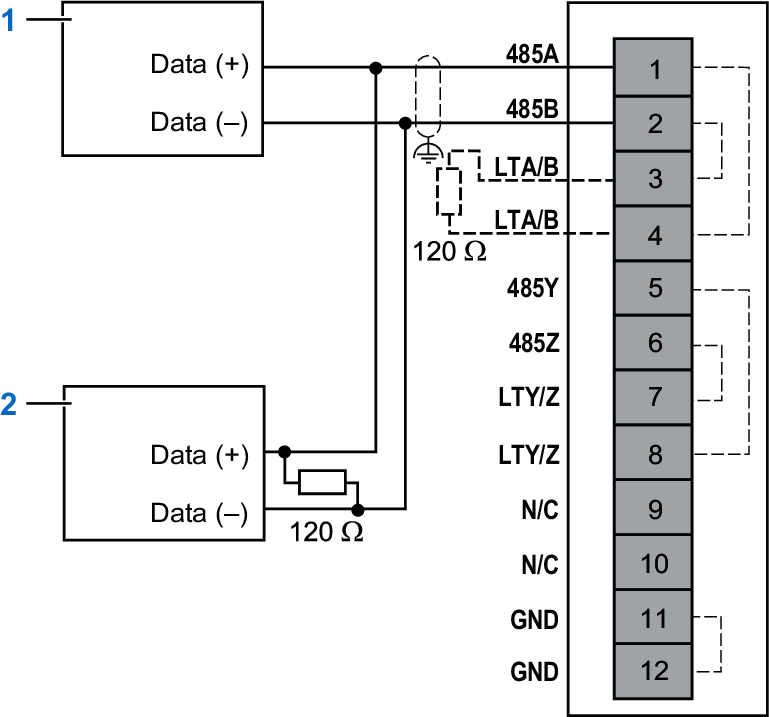
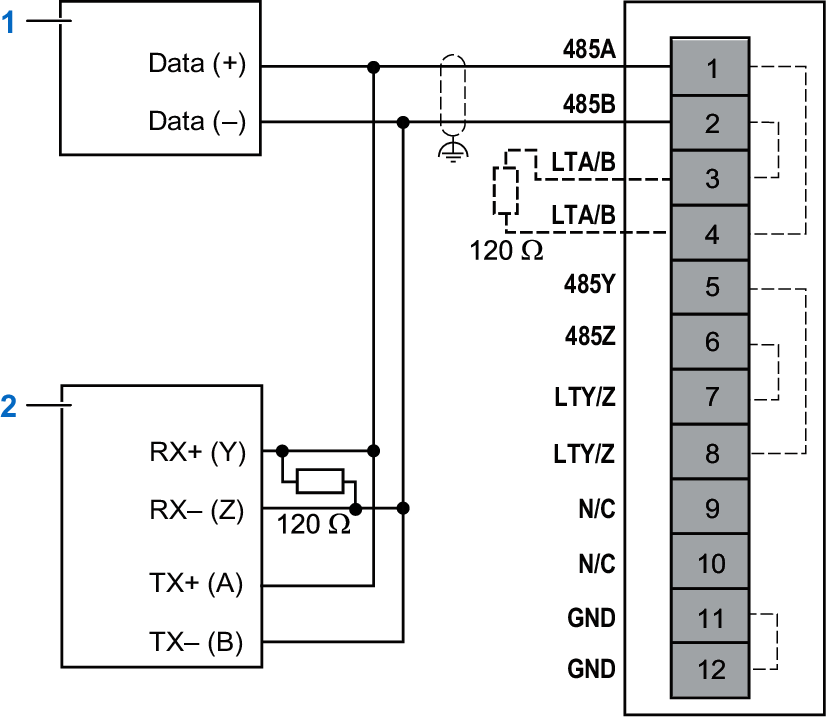
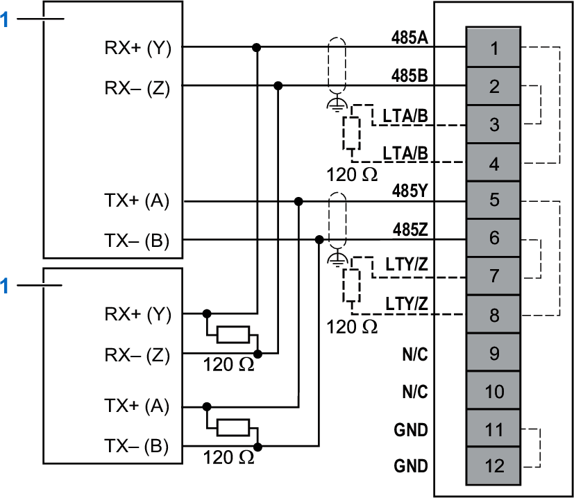
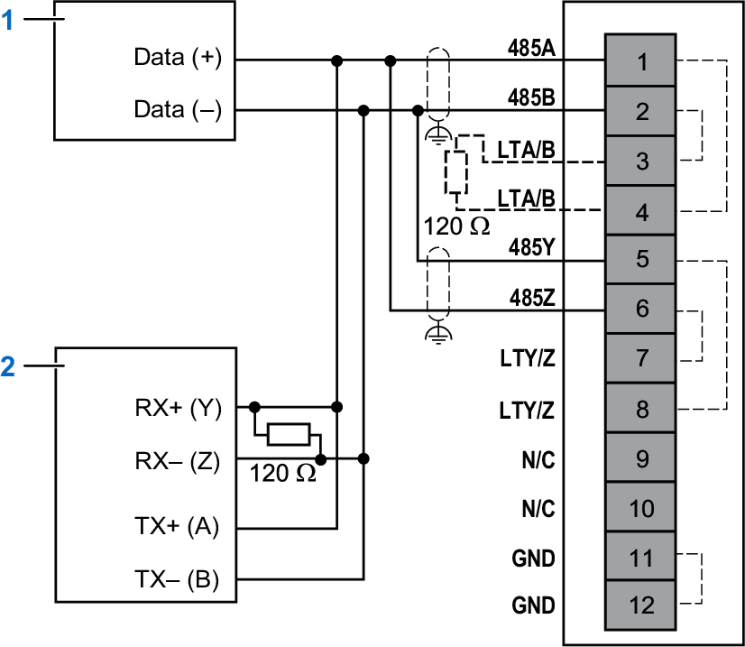

# Wiring Diagrams

## RS-422/RS-485 2-Wire Wiring Diagrams

The following figure illustrates the connections of the RS-485 2-wire devices:

**1, 2**: RS-485 2-wire devices  
**N/C**: No Connection  

| WARNING | |
| --- | --- |
|  | UNINTENDED EQUIPMENT OPERATION  Do not connect wires to unused terminals and/or terminals indicated as “No Connection (N/C)”.  Failure to follow these instructions can result in death, serious injury, or equipment damage. |

The following figure illustrates the connections of the RS-422/RS-485 2-/4-wire devices:

**1**: RS-485 2-wire device  
**2**: RS-422 4-wire device  
**N/C**: No Connection  

| WARNING | |
| --- | --- |
|  | UNINTENDED EQUIPMENT OPERATION  Do not connect wires to unused terminals and/or terminals indicated as “No Connection (N/C)”.  Failure to follow these instructions can result in death, serious injury, or equipment damage. |

## RS-422/RS-485 4-Wire Wiring Diagrams

The following figure illustrates the connections of the RS-422 4-wire devices:

**1**: RS-422 4-wire device  
**N/C**: No Connection  

| WARNING | |
| --- | --- |
|  | UNINTENDED EQUIPMENT OPERATION  Do not connect wires to unused terminals and/or terminals indicated as “No Connection (N/C)”.  Failure to follow these instructions can result in death, serious injury, or equipment damage. |

The following figure illustrates the connections of the RS422/RS-485 2-/4-wire devices:

**1**: RS-485 2-wire device  
**2**: RS-422 4-wire device  
**N/C**: No Connection  

| WARNING | |
| --- | --- |
|  | UNINTENDED EQUIPMENT OPERATION  Do not connect wires to unused terminals and/or terminals indicated as “No Connection (N/C)”.  Failure to follow these instructions can result in death, serious injury, or equipment damage. |

EIO0000005270.01