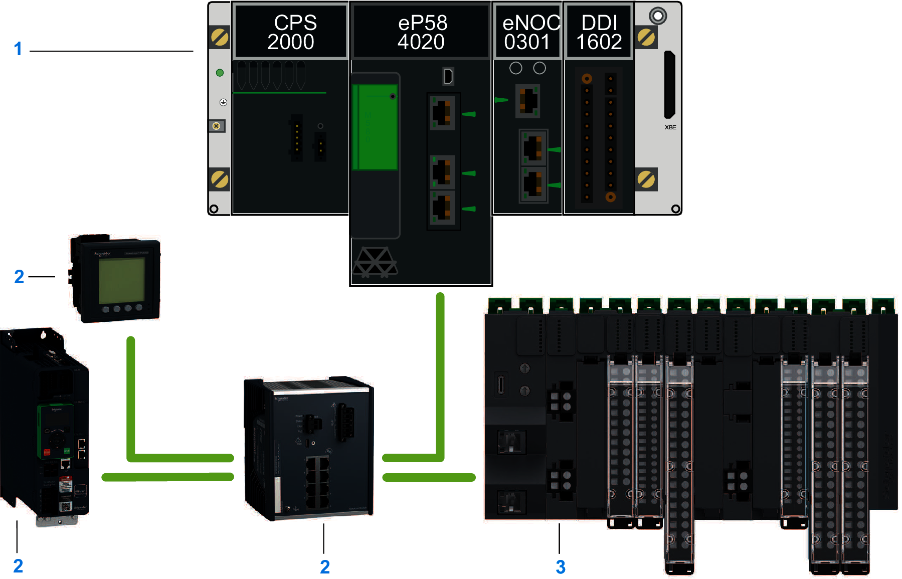
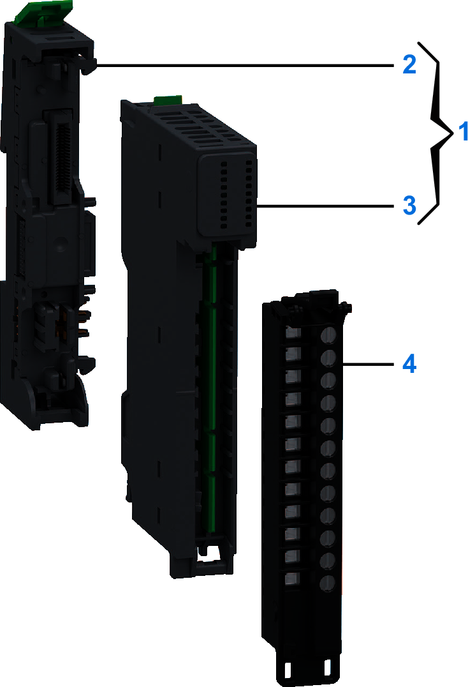

# Modicon Edge I/O System

The Modicon Edge I/O is a range of products designed for expanding and customizing the I/O capacity according to the requirements of your application.

It supports open fieldbus standards for:

* EtherNet/IP
* Modbus TCP
* Sercos III

The Modicon Edge I/O NTS is an IP20-rated system and works with distributed I/O architectures.

The following illustration presents an example of the Modicon Edge I/O NTS distributed I/O connected to a fieldbus client:

**1**: Controller

**2**: Other network devices

**3**: Main Cluster

The Modicon Edge I/O NTS slice is composed of a bus base, a module, and a terminal block as shown in this example:

**1**: Modicon Edge I/O NTS kit  
**2**: [Base](Bases-DDD76E93.html)  
**3**: [Module](NTSGeneralDescription-0F1621BC.html)  
**4**: [Terminal Block](TerminalBlocks-DFE28CB5.html)

NOTE: The bus base and the module can be purchased as a kit, and referred to as such throughout the present document. The compatible terminal block reference(s) are printed on the front side of the module.

## Hardened Equipment

Hardened equipment is a ruggedized version of the non-hardened equipment. With conformal coating of the electronic boards, the hardened equipment can be used in many harsh chemical environments, and at extended temperatures -40...+70 °C (-40...+158 °F).

NOTE: Temperature ratings are subject to derating under particular circumstances.

Hardened equipment references terminate with an 'H'.

EIO0000004786.03