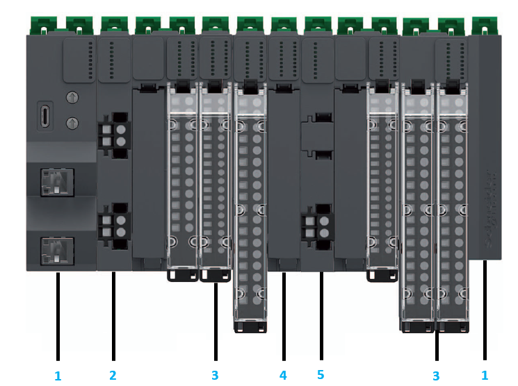

# Modicon Edge I/O NTS Main Cluster

The first cluster in a distributed I/O structure is called a main cluster and is composed with the following elements:

**1**: Network Interface Module and Spare Cluster Termination (mandatory)  
**2**: Power supply Field and Bus module (mandatory)  
**3**: Modicon Edge I/O NTS I/O modules  
**4**: Accessories  
**5**: Power supply Field Distribution module

On your main cluster:

* You can install up to 32 modules to the right of the Power supply Field and Bus module (Cluster termination excluded).
* The bandwidth usage of your installation is calculated when configuring the installation with your software. The maximum number of supported modules may be reduced for your use case.

EIO0000004786.03