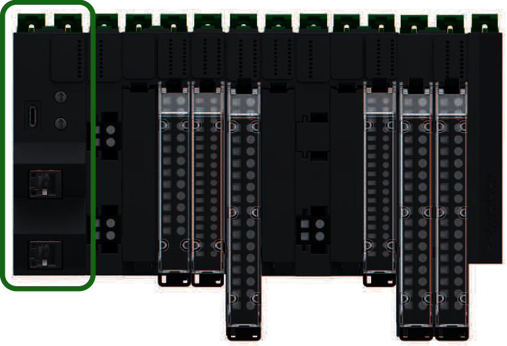

# Modicon Edge I/O NTS Network Interface Module (NIM)

The first component of a Modicon Edge I/O NTS distributed I/O main cluster is a [network interface module](NetworkInterfaceModules-16404884.html).

This module serves as the interface between the I/O modules and the fieldbus client. It is the only module on the main cluster that is dependent on the fieldbus. There are various network interface modules available for each fieldbus.

NOTE: The Power supply Field and Bus module is required and must be positioned alongside the network interface module.

The following illustration shows the location of the network interface module in a distributed I/O main cluster:

EIO0000004786.03