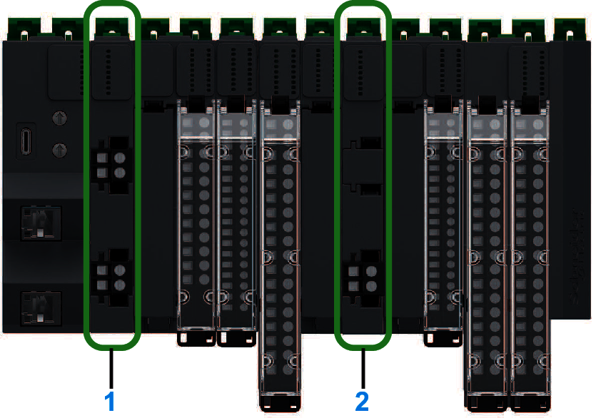

# Modicon Edge I/O NTS Power Supply (PFB and PFD)

The second component of a Modicon Edge I/O cluster configuration is a [Power supply Field and Bus (PFB)](PowerSupplyModules-98BFA4AD.html).

The Power supply Field and Bus distributes power to:

* The network interface module
* The 24 Vdc bus
* The 24 Vdc field power

The [Power supply Field Distribution (PFD)](PowerSupplyModules-98BFA4AD.html) can be added to distribute the 24 Vdc over the 24 Vdc field power segment.

For more information on the Modicon Edge I/O NTS power distribution system, refer to [Modicon Edge I/O NTS Power Distribution](ModiconEdgeIONTSPowerDistribution-24CF3A22.html).

The following illustration shows a Power supply Field and Bus and a Power supply Field Distribution on a distributed I/O cluster:

**1**: Power supply Field and Bus  
**2**: Power supply Field Distribution

EIO0000004786.03