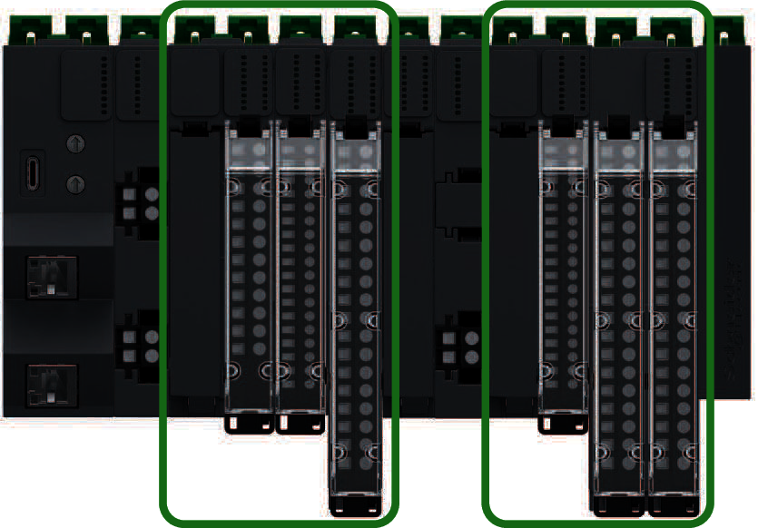

# Modicon Edge I/O NTS Modules

The following illustration shows the Modicon Edge I/O NTS I/O modules on a distributed I/O cluster:

The range of Modicon Edge I/O NTS modules includes:

* Discrete modules, classified as:

  + [Input modules](DiscreteInputModules-10AC4624.html)
  + [Output modules](DiscreteOutputModules-123B2D29.html)
* Analog modules, classified as:

  + [Input modules](AnalogInputModulesEdgeIO-13C20784.html)
  + [Output modules](AnalogOutputModules-13DBDAE1.html)
* Counting modules, classified as:

  + [Input modules](CounterInputModules-1652BADF.html)
  + [Mixed input/output modules](CounterMixedInputOutputModules-16534E68.html)
* [Motion Expert modules](MotionExpertModules-165AB366.html)
* [Field Device Master modules](FieldDeviceMasterModules-165B5AB8.html)
* [Power Supply Modules](NTSPowerDistributionModules-D58F29E2.html)
* [Common Distribution Modules](PassiveModules-98C7BFD7.html)
* [Dummy Modules](AppendixE-DD43ADF1.html)

EIO0000004786.03