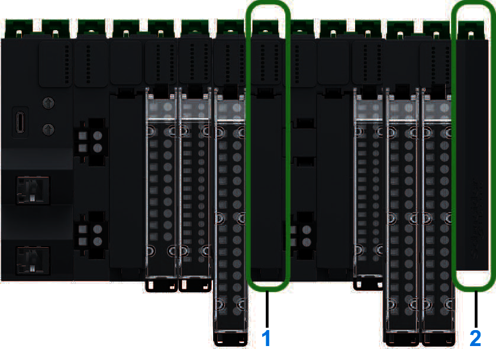

# Modicon Edge I/O NTS Accessories

The following illustration shows an example of Modicon Edge I/O NTS accessories on a distributed I/O cluster:

**1**: Dummy module  
**2**: Cluster termination

The range of Modicon Edge I/O NTS accessories includes:

* [Spare bases](SpareBases-98BFF98A.html)
* [Spare cluster termination](ClusterTermination-98C09731.html) (mandatory)
* [Terminal blocks](TPC_TerminalBlocks-F1CDE52F.html#TPC_TerminalBlocks-F1CDE52F)
* [Spare cover for terminal block](TPC_SpareCoverForTerminalBlock-F1D9A0E4.html)
* [Other Accessories (Labels, coding keys, DIN Rail end stoppers)](Accessories-13554501.html)

EIO0000004786.03