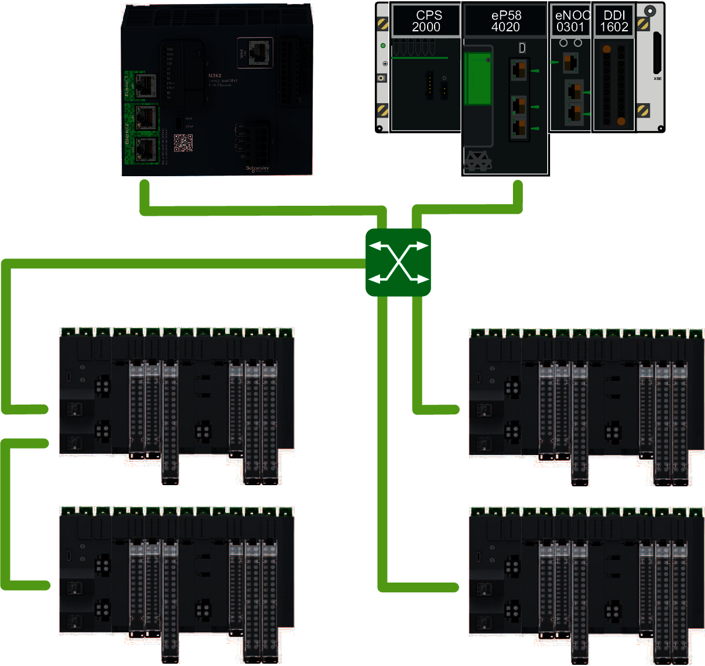
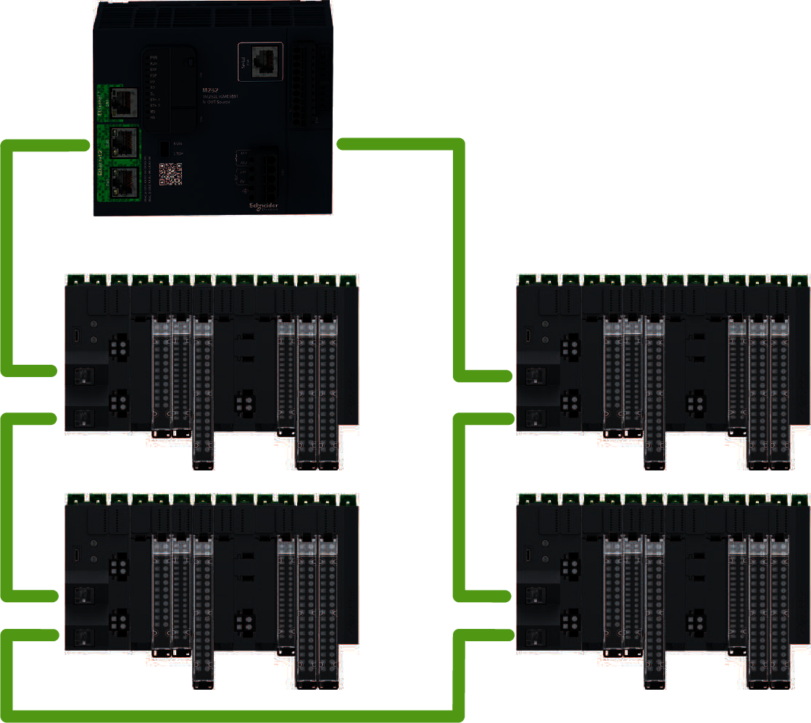
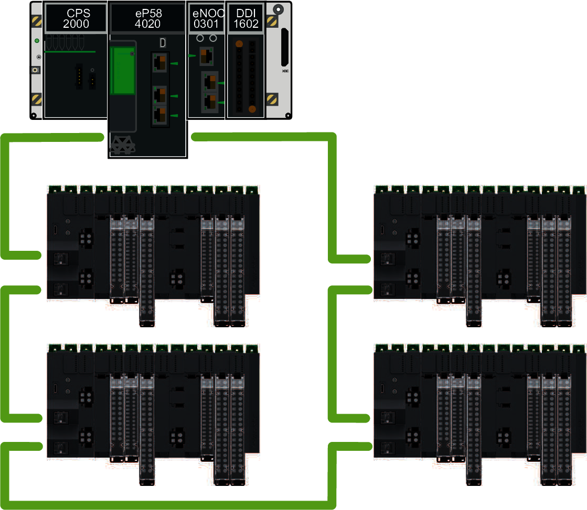
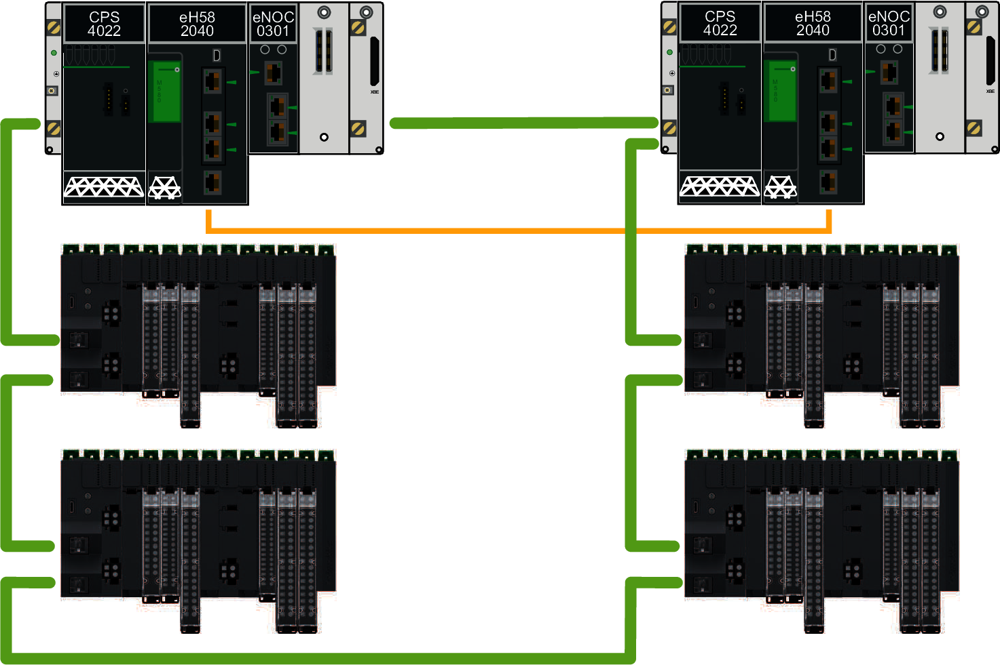

# Modicon Edge I/O Network Structure with Modbus TCP and EtherNet/IP

The Modicon Edge I/O system supports the following distributed I/O network topologies:

* Line topology
* Star topology
* Ring topology

The following illustration shows the line and star network topologies with several Modicon Edge I/O NTS main clusters:

The following illustration shows an RSTP ring network topology with an M262 controller and several Modicon Edge I/O NTS main clusters:

The following illustration shows an RSTP ring network topology with an M580 controller and several Modicon Edge I/O NTS main clusters:

The following illustration shows an RSTP ring network topology with M580 redundant controllers and several Modicon Edge I/O NTS main clusters:

NOTE: RSTP service is enabled by default. All nodes of an RSTP ring must support RSTP and must have RSTP service enabled.

EIO0000004786.03