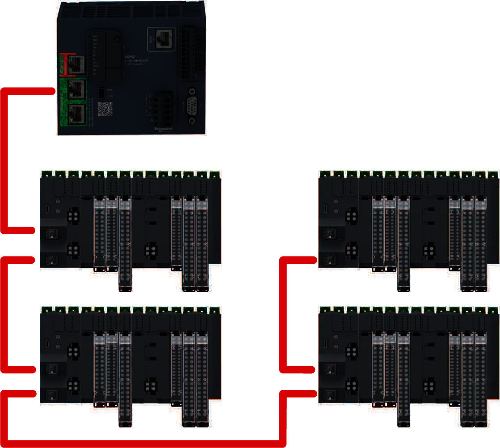
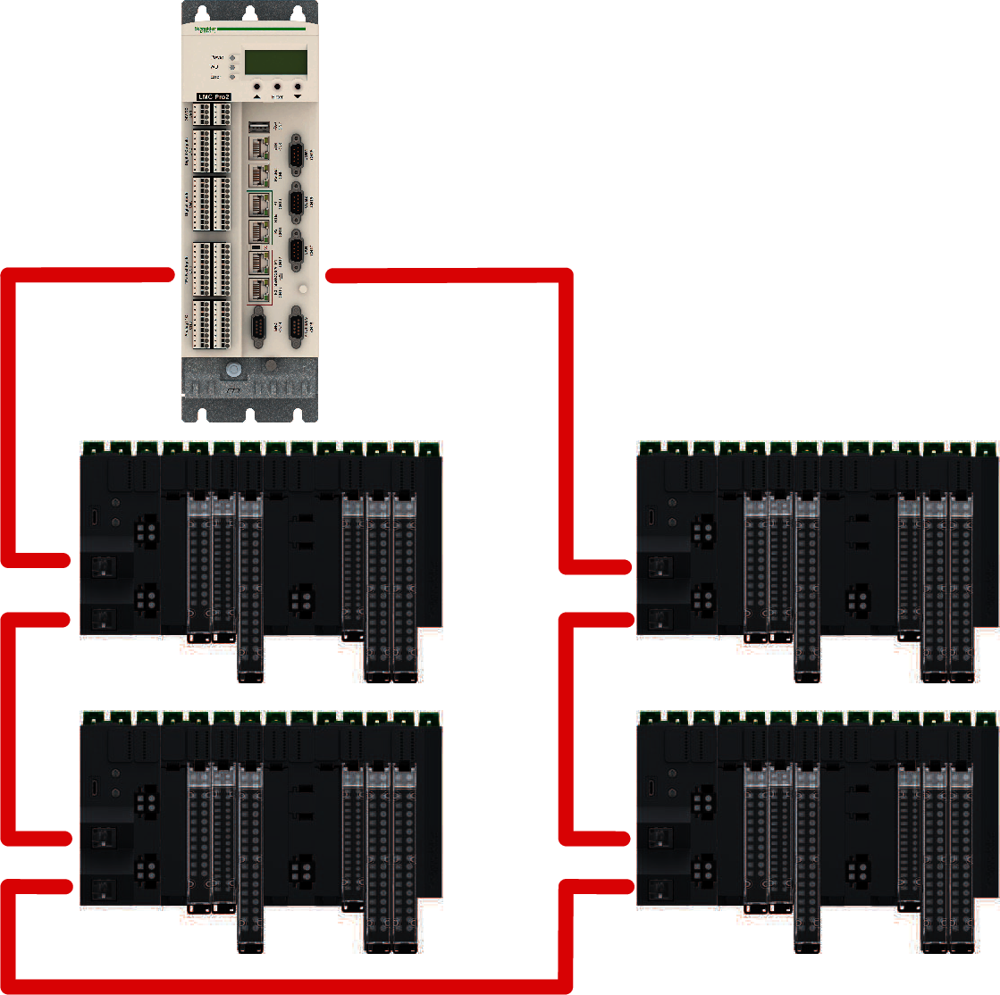

# Modicon Edge I/O Network Structure with Sercos III

The Modicon Edge I/O system supports the following distributed I/O network topologies:

* Line topology
* Ring topology

The following illustration shows the line network topology with an M262 controller and several Modicon Edge I/O NTS main clusters:

The following illustration shows a ring network topology with a PacDrive LMC Pro/Pro2 controller and several Modicon Edge I/O NTS main clusters:

EIO0000004786.03