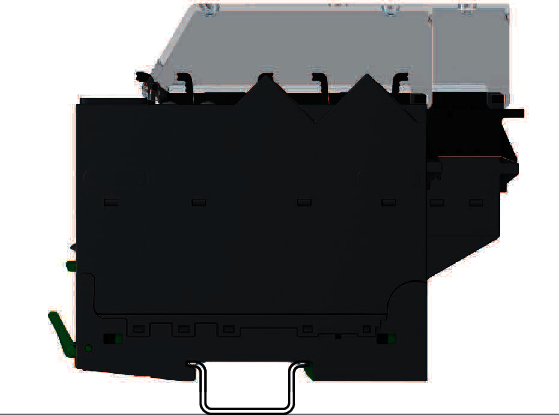

# Acceptable Mounting Positions

The Modicon Edge I/O NTS system can be mounted in two positions with a [temperature derating](EnvironmentalCharacteristics-2C0E6A68.html):

* Horizontally on a horizontal plane as shown in the following figure:

  
* Vertically on a vertical plane as shown in the following figures:

  |  |  |
  | --- | --- |
  |  |  |

EIO0000004786.03