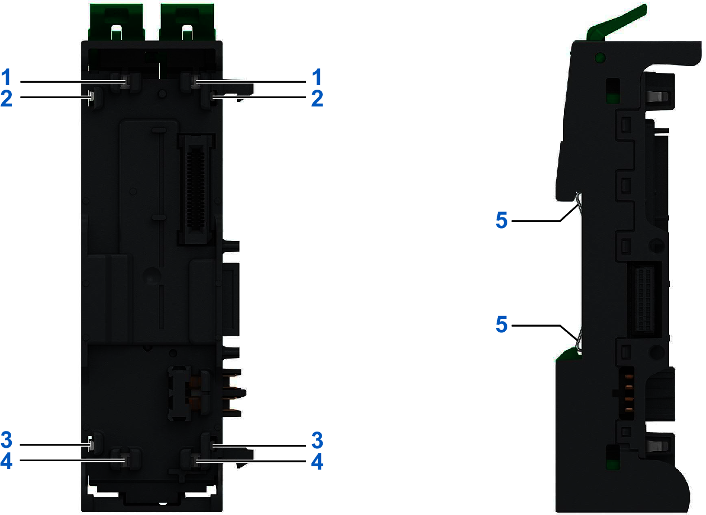

# Grounding Function

The DIN rail must be attached to a conductive backplane that is connected to a protective ground (PE).

Each base is equipped with several metal spring contacts. When properly mounted on a metal DIN rail, these contacts provide connection to the functional ground (FE) for the entire system.

**1,2,3,4,5:** Ground Contacts

To help achieve the electrostatic discharge and electromagnetic compatibility stated performances, use a rail connected to a backplane with good electrical conductive surfaces.

EIO0000004786.03