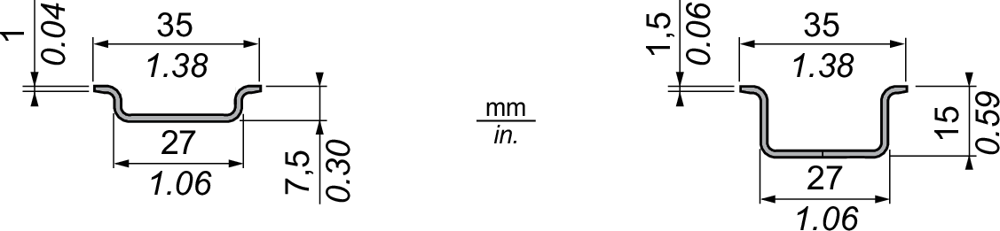
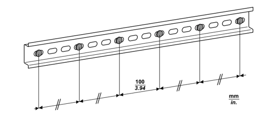

# Mounting the DIN Rail

The Modicon Edge I/O system is designed to be mounted on a DIN rail (35 x 7.5 mm or 35 x 15 mm) made from an electro zinc-plated steel according to IEC60715. For EMC (Electromagnetic Compatibility) compliance, a metal DIN rail must be attached to a flat metal mounting surface or mounted on an EIA (Electronic Industries Alliance) rack or in a NEMA (National Electrical Manufacturers Association) cabinet enclosure.

The following DIN rails are supported for use with the Modicon Edge I/O systems:

| Reference | Rail Depth |
| --- | --- |
| NSYSDR200BD | 7.5 mm (0.27 in.) |
| NSYSDR200D | 15 mm (0.59 in.) |

The mounting hardware must be installed at the end positions and at 100 mm (3.94 in) maximum increments along the length of the rail.

The following illustration presents the mounting requirements for the DIN rail:

| WARNING | |
| --- | --- |
|  | UNINTENDED EQUIPMENT OPERATION  * Verify that the DIN rail is securely installed with mounting hardware at the end positions and at 100 mm (3.94 in.) maximum increments along the length of the rail. * Verify that the DIN rail is firmly connected to a conductive backplane, and that the conductive backplane is secured to a protective ground as specified in this guide and in accordance with local regulations.  Failure to follow these instructions can result in death, serious injury, or equipment damage. |

EIO0000004786.03