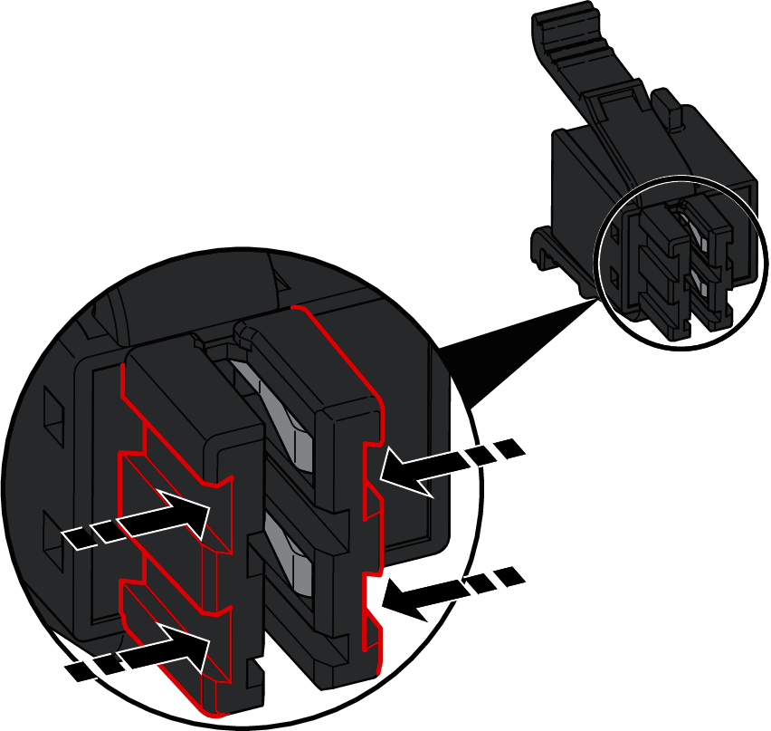
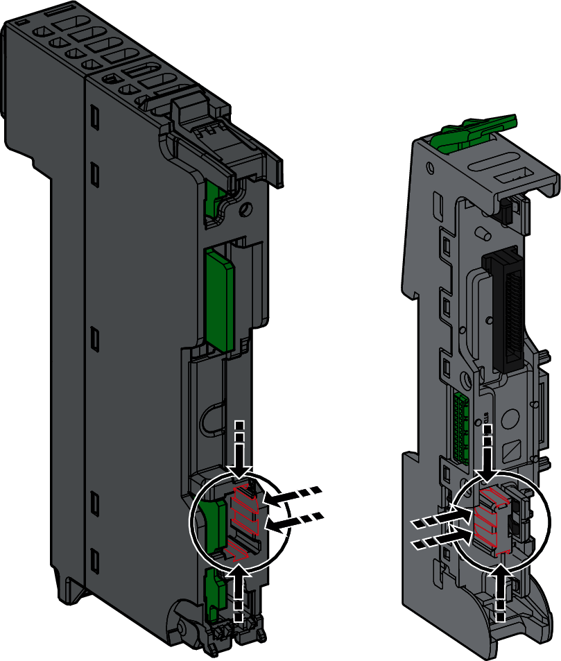

# Overview

Use coding keys and labeling tools to associate terminal blocks, modules and base plates, which can help minimize mounting and maintenance errors.

The following illustrations present how the coding keys create a mechanical interference between the terminal block and the module:

|  |  |
| --- | --- |
|  |  |

The following illustration presents the location of the coding key slots on a power supply terminal block:

NOTE: Use coding keys to avoid mismatches between the 24 Vdc field power (CN1) and 24 Vdc bus (CN2) terminal blocks on the Power supply Field and Bus module.

The following illustrations present the location of the coding key slots on the back of a module and on a base plate:

EIO0000004786.03