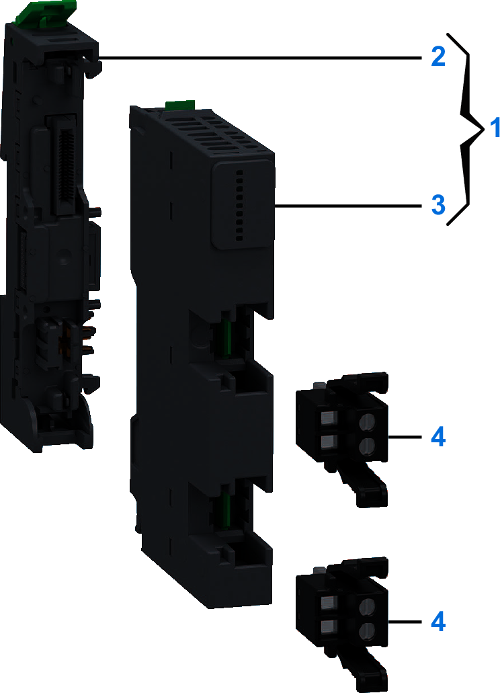
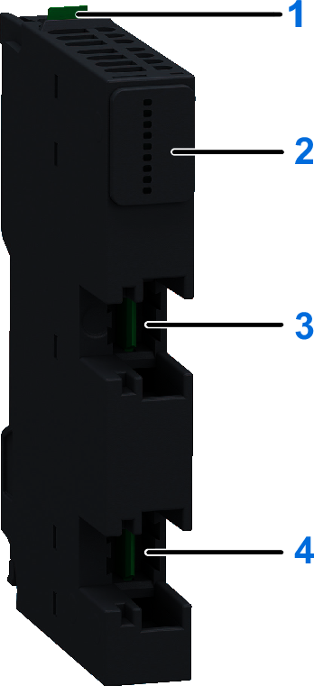
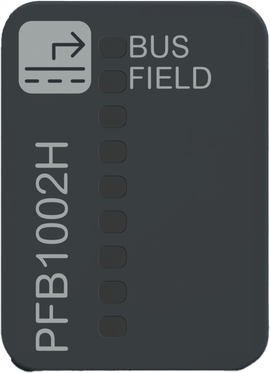

# NTSPFB1002H Presentation

## Overview

The NTSPFB1002H is a standard hardened Power supply Field and Bus module.

The second component in the configurations of a Modicon Edge I/O cluster is always a [Power supply Field and Bus (PFB)](PowerSupplyModules-98BFA4AD.html).

The Power supply Field and Bus distributes power to:

* The network interface module
* The 24 Vdc bus
* The 24 Vdc field power

## Main Characteristics

The following table describes the main characteristics of the Modicon Edge I/O NTS NTSPFB1002H power supply module:

| Main Characteristics | Range |
| --- | --- |
| Maximum current provided on the 24 Vdc bus | 3.5 A |
| Maximum current provided on a 24 Vdc field power segment | 10.5 A |

For more information about the power distribution on a Modicon Edge I/O NTS island, refer to [Modicon Edge I/O NTS Power Distribution](ModiconEdgeIONTSPowerDistribution-24CF3A22.html).

## Purchasing Information

The following figure shows the elements of the Modicon Edge I/O NTS NTSPFB1002H power supply module:

| Number | Reference | Description |
| --- | --- | --- |
| 1 | NTSPFB1002HK | Base + Module (kit) NOTE: The module and its corresponding base can be purchased as a kit. |
| 2 | NTSXBA0103H | Spare Base, 1 Slot, for Power Supply Field and Bus Module, Hardened |
| 3 | NTSPFB1002H | Power Supply Module, 24 Vdc, Field and Bus, Hardened |
| 4 | NTSXTB02030H | Screw Terminal Block, 2 Points, 5 mm Pitch, use on Power Supply Module, Hardened |
| NTSXTB02230H | Spring Terminal Block, 2 Points, 5 mm Pitch, use on Power Supply Module, Hardened  **NOTE:** The terminal blocks are purchased separately. |

NOTE: For more information on accessories and spare parts, refer to [Modicon Edge I/O NTS Accessories](Accessories-13554501.html).

## Physical Description

The following figure presents the elements of the module:

**1**: Release button for disengaging the module from the base  
**2**: Status LEDs  
**3**: Slot for the terminal block dedicated to the bus power supply  
**4**: Slot for the terminal block dedicated to the field power supply

## Status LEDs

The following figure presents the NTSPFB1002H status LEDs:

The following table describes the status of LEDs:

| BUS (Green) | FIELD (Green) | Description |
| --- | --- | --- |
| OFF | - | Indicates either:   * The 24 Vdc bus is not energized. * The module has detected an error and is in shutdown. |
| ON | - | 24 Vdc bus is energized. |
| - | OFF | Indicates either:   * The 24 Vdc field power is not energized. * The module has detected an error and is in shutdown. * The 24 Vdc bus is not energized. |
| - | ON | Normal operation |

NOTE: When in shutdown following the detection of an overload or short circuit error, the equipment must be power cycled after you have resolved the source of the error.

EIO0000004786.03