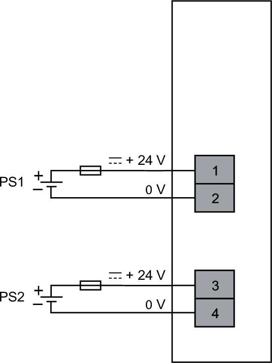

# NTSPFB1002H Wiring Diagram

The Power supply Field and Bus module is the first module of the distributed I/O configuration connected to an external 24 Vdc power supply.

The Power supply Field and Bus module requires two power supplies:

1. A 24 Vdc power supply to supply power to the 24 Vdc bus.
2. A 24 Vdc power supply to supply power to the first segment of the 24 Vdc field power.

**PS1 (CN2), PS2 (CN1)**: To select the power supply and external fuse, refer to [Electrical Requirements](ElectricalRequirements-24CFEA80.html).

EIO0000004786.03