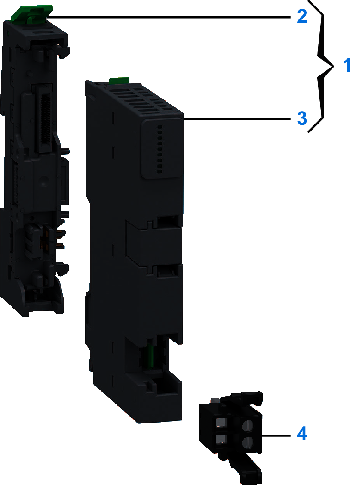
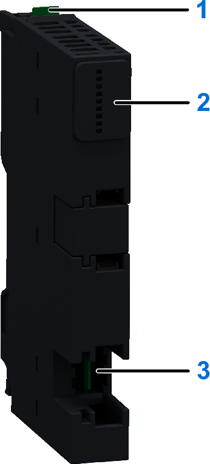
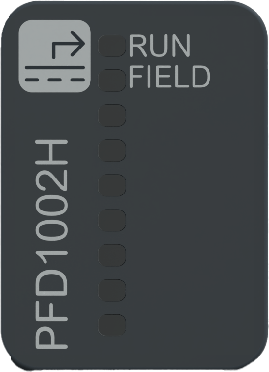

# NTSPFD1002H Presentation

## Overview

The NTSPFD1002H is a standard hardened Power supply Field Distribution module.

Where and when needed, the [Power supply Field Distribution](PowerSupplyModules-98BFA4AD.html) (PFD) can be added to distribute the 24 Vdc over the 24 Vdc field power segment.

## Main Characteristics

The following table describes the main characteristics of the Modicon Edge I/O NTS NTSPFD1002H power supply module:

| Main Characteristics | Range |
| --- | --- |
| Maximum current provided on the 24 Vdc bus | 0 A |
| Maximum current provided on a 24 Vdc field power segment | 10.5 A |

For more information about the power distribution on a Modicon Edge I/O NTS, refer to [Modicon Edge I/O NTS Power Distribution](ModiconEdgeIONTSPowerDistribution-24CF3A22.html).

## Purchasing Information

The following figure shows the elements of the Modicon Edge I/O NTS NTSPFD1002H power supply module:

| Number | Reference | Description |
| --- | --- | --- |
| 1 | NTSPFD1002HK | Base + Module (kit) NOTE: The module and its corresponding base can be purchased as a kit. |
| 2 | NTSXBA0104H | Spare Base, 1 Slot, for Power Supply Field Distribution Module, Hardened |
| 3 | NTSPFD1002H | Power Supply Module, 24 Vdc, Field, Hardened |
| 4 | NTSXTB02030H | Screw Terminal Block, 2 Points, 5 mm Pitch, use on Power Supply Module, Hardened |
| NTSXTB02230H | Spring Terminal Block, 2 Points, 5 mm Pitch, use on Power Supply Module, Hardened  **NOTE:** The terminal blocks are purchased separately. |

NOTE: For more information on accessories and spare parts, refer to [Modicon Edge I/O NTS Accessories](Accessories-13554501.html).

## Physical Description

The following figure presents the elements of the module:

**1**: Release button for disengaging the module from the base  
**2**: Status LEDs  
**3**: Slot for the terminal block dedicated to the 24 Vdc field power supply

## Status LEDs

The following figure presents the NTSPFD1002H status LEDs:

The following table describes the status of LEDs:

| RUN (Green) | FIELD (Green) | Description |
| --- | --- | --- |
| OFF | - | 24 Vdc bus is not energized. |
| Regular Flash | - | 24 Vdc bus is energized, but the module is not detected by the network interface module. |
| ON | - | 24 Vdc bus is energized and the module is detected by the network interface module. |
| - | OFF | Indicates either:   * The 24 Vdc field power is not energized. * The module has detected an error and is in shutdown. * The 24 Vdc bus is not energized. |
| - | ON | Normal operation. |

NOTE: When in shutdown following the detection of an overload or short circuit error, the equipment must be power cycled after you have resolved the source of the error.

EIO0000004786.03