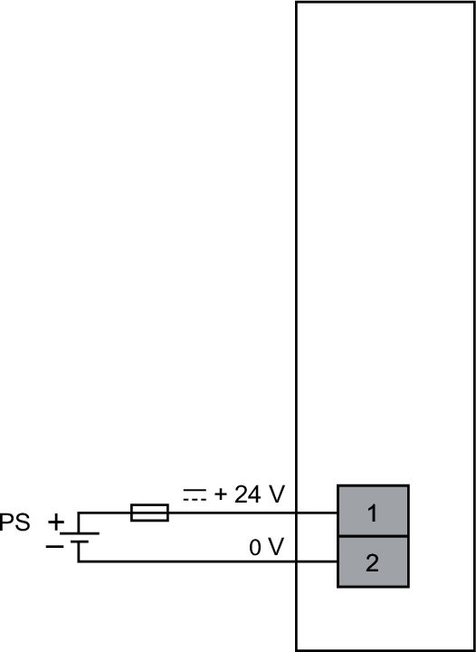

# NTSPFD1002H Wiring Diagram

Each Power supply Field Distribution module creates a separate 24 Vdc field power segment, which is supplied by an external 24 Vdc power supply.

Each Power supply Field Distribution module has its own 24 Vdc power supply connection.

**PS (CN1)**: To select the power supply and external fuse, refer to the [Electrical Requirements](ElectricalRequirements-24CFEA80.html)

EIO0000004786.03