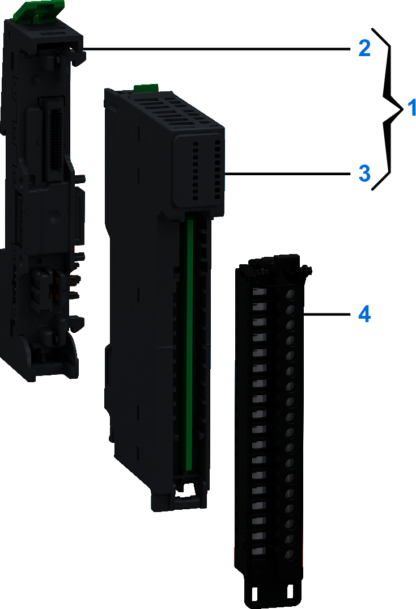
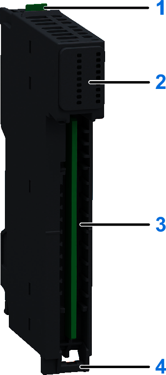
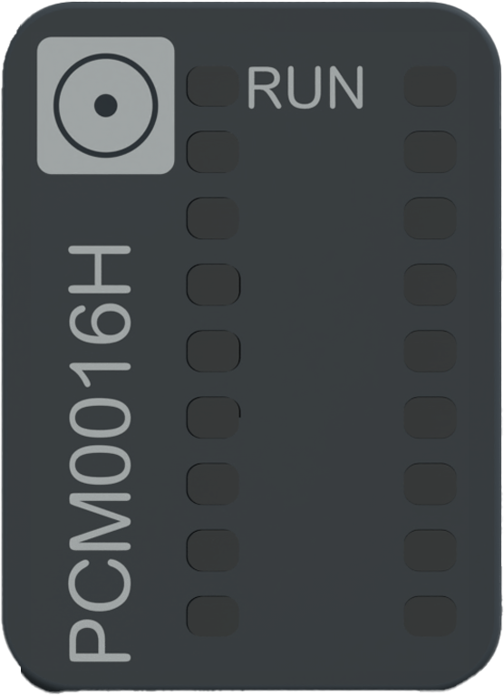

# NTSPCM0016H Presentation

## Overview

The NTSPCM0016H common distribution module provides 16 x 0 Vdc terminal connections from the 24 Vdc field power segment, can be used for additional wiring for sensors and actuators.

## Main Characteristics

The following table describes the main characteristics of the Modicon Edge I/O NTS NTSPCM0016H module:

| Main Characteristics | Range | |
| --- | --- | --- |
| Power supply source | From the 24 Vdc field power | |
| Type of common connections | 0 Vdc | 24 Vdc |
| Number of common connections | 16 | 0 |

## Purchasing Information

The following figure shows the elements of the Modicon Edge I/O NTS NTSPCM0016H common distribution module:

| Number | Reference | Description |
| --- | --- | --- |
| 1 | NTSPCM0016HK | Base + Module (kit)  NOTE: The module and its corresponding base can be purchased as a kit. |
| 2 | NTSXBA0100H | Spare Base, 1 Slot, for Input/Output Common or Expert Module, Hardened |
| 3 | NTSPCM0016H | Common Distribution Module, 0 Vdc, 16 Points, Hardened |
| 4 | NTSXTB18000H | Screw Terminal Block, 18 Points, 3.81 mm Pitch, Without Cover, use on Low Height Module, Hardened |
| NTSXTB18001H | Screw Terminal Block, 18 Points, 3.81 mm Pitch, With Cover, use on Low Height Module, Hardened |
| NTSXTB18200H | Spring Terminal Block, 18 Points, 3.81 mm Pitch, Without Cover, use on Low Height Module, Hardened |
| NTSXTB18201H | Spring Terminal Block, 18 Points, 3.81 mm Pitch, With Cover, use on Low Height Module, Hardened  **NOTE:** The terminal blocks are purchased separately. |

## Physical Description

The following figure presents the elements of the module:

**1**: Release button for disengaging the module from the base  
**2**: Status LED  
**3**: Slot for the terminal block  
**4**: Hinge for the terminal block installation

## Status LEDs

The following figure presents the NTSPCM0016H status LED:

The following table describes the status of LED:

| RUN (Green) | Description |
| --- | --- |
| OFF | 24 Vdc bus is not energized. |
| Regular Flash | 24 Vdc bus is energized but the module is not detected by the network interface module. |
| ON | 24 Vdc bus is energized and the module is detected by the network interface module. |

The following graphic depicts the system status of LEDs during module operation:

EIO0000004786.03