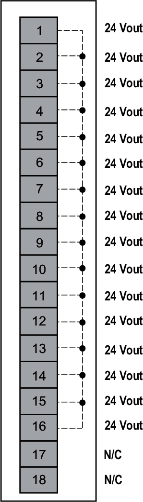
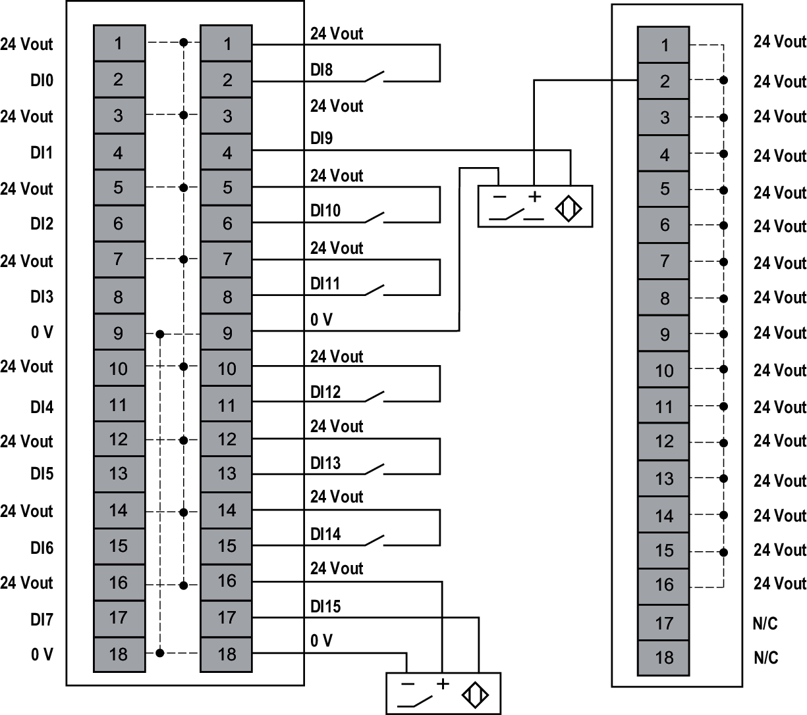

# NTSPCM1600H Wiring Diagram

The following figure illustrates the connections for the NTSPCM1600H:

**N/C**: No Connection

| WARNING | |
| --- | --- |
|  | UNINTENDED EQUIPMENT OPERATION  Do not connect wires to unused terminals and/or terminals indicated as “No Connection (N/C)”.  Failure to follow these instructions can result in death, serious injury, or equipment damage. |

The following figure illustrates an example for the NTSPCM1600H connections with a NTSDDI1602X:

**N/C**: No connection

| WARNING | |
| --- | --- |
|  | UNINTENDED EQUIPMENT OPERATION  Do not connect wires to unused terminals and/or terminals indicated as “No Connection (N/C)”.  Failure to follow these instructions can result in death, serious injury, or equipment damage. |

NOTE: I/O modules and the field devices connected to the common module must all reside on the same 24 Vdc field power segment.

| WARNING | |
| --- | --- |
|  | POTENTIAL EXPLOSION OR FIRE  Connect the returns from the devices to the same power source as the 24 Vdc field power segment serving the module.  Failure to follow these instructions can result in death, serious injury, or equipment damage. |

EIO0000004786.03