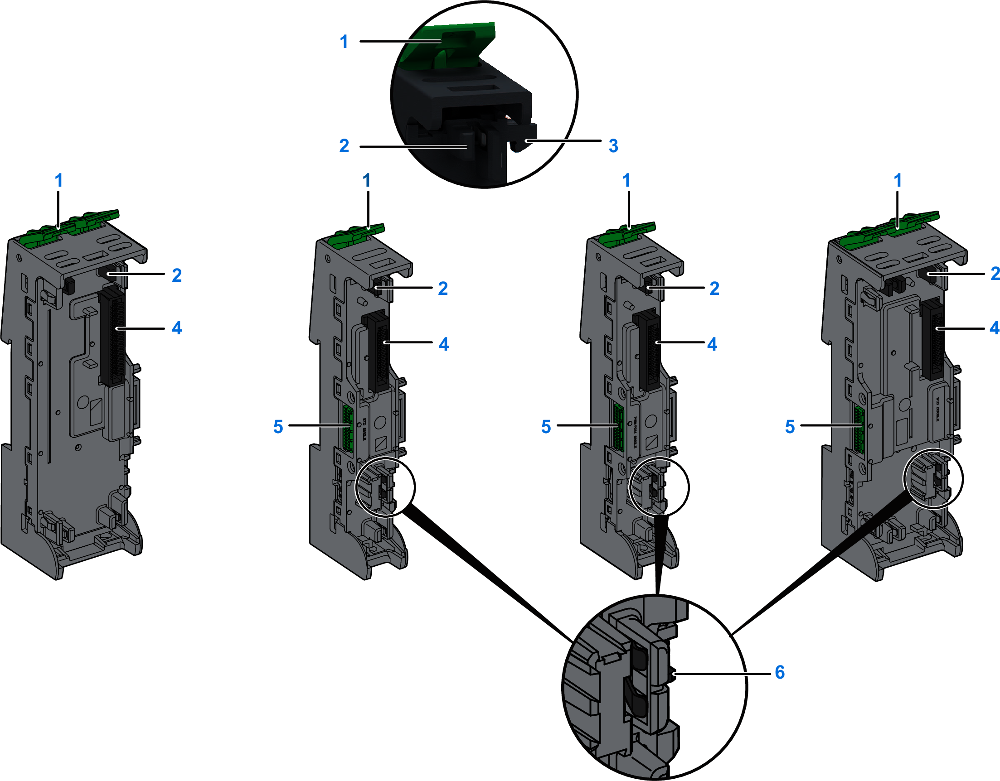

# Spare Bases Overview

The bases interconnected on the DIN rail form a structure that provides the physical connections for the I/O modules of the Modicon Edge I/O NTS cluster. This structure houses the I/O modules, supports the communications buses and provides power across the cluster.

A set of contacts on the side of the bases enables the modules to receive the 24 Vdc bus, the 24 Vdc field power, the auto-addressing signal, and bus communications.

There are four types of spare bases:

* The NTSXBA•••0H bases are designed to host Input/Output, Common, and Expert modules.
* The NTSXBA•••1H bases are designed to host the network interface modules.
* The NTSXBA•••3H bases are designed to host the Power supply Field and Bus modules.
* The NTSXBA•••4H bases are designed to host the Power supply Field Distribution modules.

**1**: Locking lever.  
**2**: Functional ground (FE) / direct connection to DIN rail through an earth contact.  
**3**: Base to base fixing hook.  
**4**: Module connector.  
**5**: 24 Vdc bus connector.  
**6**: 24 Vdc field power connector.

NOTE:

* Match specific bases with compatible module types and place the correct bases in the appropriate locations within the cluster.
* If there is a mechanical keying that prevents the installation of a module on a base, verify the configuration and that the module is intended for the base.
* Bases are designed to accommodate both hardened and standard modules.

| DANGER | |
| --- | --- |
|  | INCOMPATIBLE COMPONENTS CAUSE ELECTRIC SHOCK OR ARC FLASH  * Always confirm the compatibility of components before installation using the association table in this manual. * Verify that correct terminal blocks are installed on the appropriate electronic modules  Failure to follow these instructions will result in death or serious injury. |

EIO0000004786.03