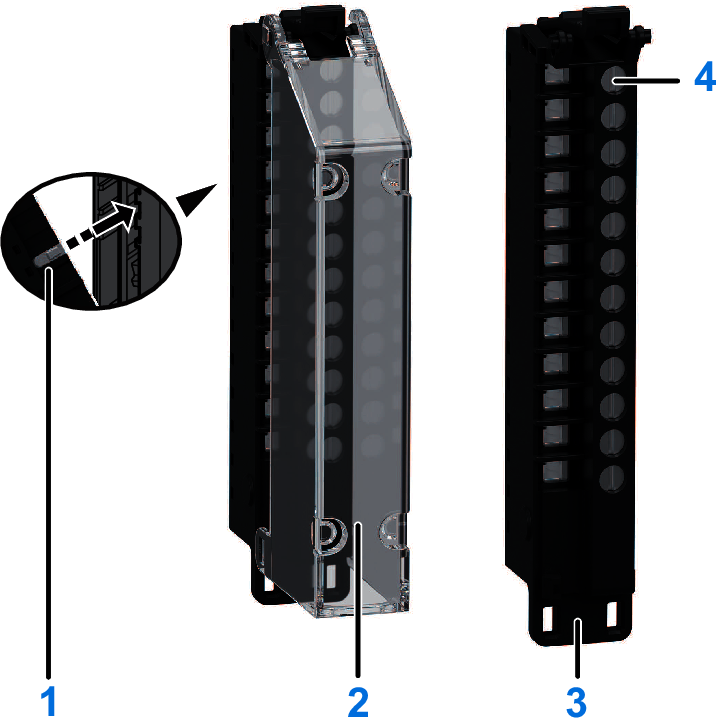
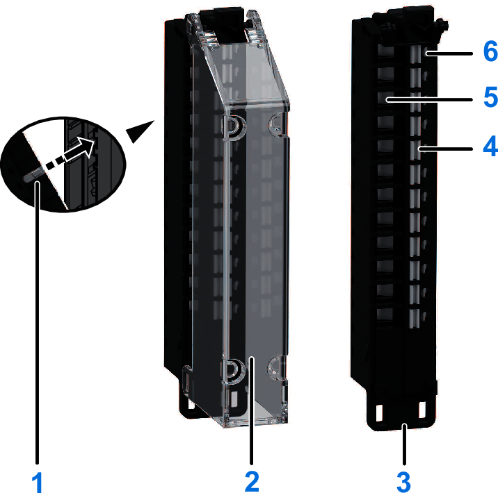

# Terminal Blocks Overview

There are four types of terminal blocks:

* The NTSXTB1••0•H and NTSXTB1••0•XH terminal blocks are designed for DC input/output modules.
* The NTSXTB12•1•H terminal blocks are designed for AC input/output modules.
* The NTSXTB02•30H terminal blocks are designed for power supply modules.

| WARNING | |
| --- | --- |
|  | UNINTENDED EQUIPMENT OPERATION  Do not exceed any of the rated values specified in the environmental and electrical characteristics tables.  Failure to follow these instructions can result in death, serious injury, or equipment damage. |

The following illustrations present the features of the screw terminal block:

**1**: [Coding key slots](CodingTheModiconEdgeIONTS27DA0081.html).  
**2**: [Plain text labeling](PlainTextInstallationOnClearCover-27DA8221.html) possible with a clear cover  
**3**: Flange on terminal block to fix a cable tie to fasten cables.  
**4**: [Test access](TPC_TestProbes-F5640D2A.html) for standard probes on the screw.

The following illustrations present the features of the spring terminal block:

**1**: [Coding key slots](CodingTheModiconEdgeIONTS27DA0081.html).  
**2**: [Plain text labeling](PlainTextInstallationOnClearCover-27DA8221.html) possible with a clear cover.  
**3**: Flange on terminal block to fix a cable tie to fasten cables  
**4**: Push-button wire release.  
**5**: Tool-free wiring with spring clamp push-in technology.  
**6**: [Test access](TPC_TestProbes-F5640D2A.html) for standard probes.

EIO0000004786.03