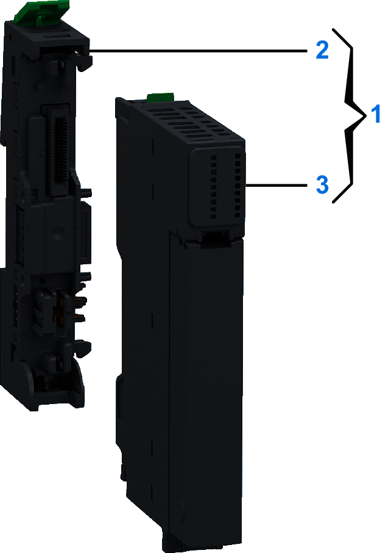
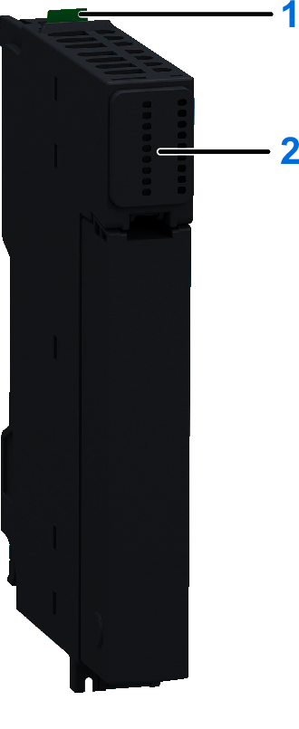

# NTSDMY0100H Dummy Module, Single Slot, Hardened

## Overview

The NTSDMY0100H is a non-functional module used as a placeholder for later system extension.

For more information on using a dummy module, refer to [The Layout of your Modicon Edge I/O NTS Island](TheLayoutOfYourModiconEdgeIONTSIsland-24D57A3E.html).

## Main Characteristics

The environmental characteristics of the NTSDMY0100H are described in the section [Operating Environment](OperatingEnvironment-20A0B300.html).

| WARNING | |
| --- | --- |
|  | UNINTENDED EQUIPMENT OPERATION  Do not exceed any of the rated values specified in the environmental and electrical characteristics tables.  Failure to follow these instructions can result in death, serious injury, or equipment damage. |

## Purchasing Information

The following figure shows the elements of the Modicon Edge I/O NTS NTSDMY0100H dummy module:

| Number | Reference | Description |
| --- | --- | --- |
| 1 | NTSDMY0100HK | Base + Module (kit)  NOTE: The module and its corresponding base can be purchased as a kit. |
| 2 | NTSXBA0100H | Spare Base, 1 Slot, for Input/Output Common or Expert Module, Hardened |
| 3 | NTSDMY0100H | Dummy Module, Single Slot, Hardened |

## Physical Description

The following figure presents the elements of the dummy module:

**1**: Release button for disengaging the module from the base  
**2**: No LEDs are installed.

## Dimension

The following figure presents the external dimensions of the assembled module:

|  |  |
| --- | --- |
|  |  |

**a**: 15 mm (0.59 in)  
**b**: 114.1 mm (4.49 in)  
**c**: 80.7 mm (3.15 in)  
**c1**: 5.6 mm (0.2 in)

## Weight

* NTSDMY0100H: 32 g (1.13 oz)
* NTSDMY0100HK: 53 g (1.83 oz)

EIO0000004786.03