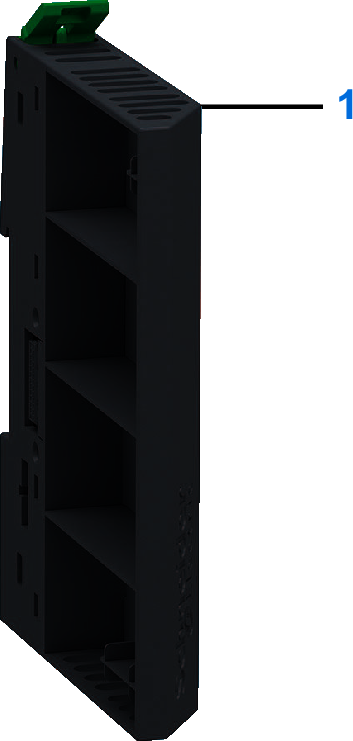

# Cluster Termination

## Overview

The Cluster Termination must be used on the rightmost position of the Modicon Edge I/O NTS cluster.

## Purchasing Information

The following figure presents the elements of the Modicon Edge I/O NTS Cluster Termination:

| Number | Reference | Description |
| --- | --- | --- |
| 1 | NTSXMP0000H | Spare Cluster Termination, Hardened. |

## Physical Description

The following figure presents the elements of the Cluster Termination:

## Dimension

The following figure presents the external dimensions of the Cluster Termination:

|  |  |
| --- | --- |
|  |  |

**a**: 15 mm (0.59 in)  
**b**: 108.6 mm (4.27 in)  
**c**: 79.1 mm (3.11 in)  
**c1**: 5.6 mm (0.2 in)

EIO0000004786.03