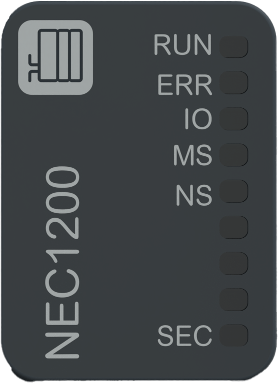

# Status LEDs

The following figure presents the NTSNEC1200/NTSNEC1200H network interface module status LEDs:

The following table describes the status of LEDs during the module initialization mode:

| RUN | ERR | **IO** | **MS** | **NS** | **SEC** | Description |
| --- | --- | --- | --- | --- | --- | --- |
| OFF | Red ON | OFF | OFF | OFF | OFF | Indicates the first initialization step: power supply initialization. |
| OFF | Red Regular Flash | OFF | Red Regular Flash | OFF | OFF | Indicates the second initialization step: network interface modules Boot-up. |
| OFF | OFF | OFF | OFF | OFF | OFF | Indicates the third initialization step: all LEDs OFF. |
| OFF | OFF | OFF | Green ON | Green ON | OFF | Indicates the fourth initialization step: **MS** and **NS** LEDs green ON for 250 ms. |
| OFF | OFF | OFF | Red ON | Red ON | OFF | Indicates the fifth initialization step: **MS** and **NS** LEDs red ON for 250 ms. |
| OFF | OFF | OFF | OFF | OFF | OFF | Indicates the sixth initialization step: all LEDs OFF for 250 ms. |
| Green ON | Red ON | Green ON | Green ON | Green ON | Green ON | Indicates the seventh initialization step: all LEDs ON. |
| OFF | OFF | OFF | OFF | Green ON | OFF | Indicates that a reboot is needed for new IP address assignment. |
| Green Regular Flash | OFF | OFF | Red ON | Red ON | Green Regular Flash | Indicates that the factory reset is in progress. |
| Green ON | OFF | OFF | Red ON | Red ON | Green ON | Indicates that the factory reset is completed. |
| OFF | Red Regular Flash | OFF | Green Regular Flash | OFF | - | Indicates that no IP address is entered and no configuration is received. |
| OFF | Red Regular Flash | OFF | Green Regular Flash | Green Regular Flash | - | Indicates that a valid IP address is entered but no configuration is received.(1) |
| Green Regular Flash | OFF | - | Green Regular Flash | - | - | Indicates that no IP address is entered and configuration is received. |
| Green Regular Flash | OFF | - | Green ON | - | - | Indicates that a valid IP address is entered and configuration is received.(1) |
| Green Regular Flash | OFF | OFF | Red ON | Red ON | - | Indicates that the firmware is being updated. |
| Green Regular Flash | Red Regular Flash | Orange Regular Flash | Orange Regular Flash | Orange Regular Flash | Orange Regular Flash | Indicates that the device identification is ongoing. |
| OFF | Red ON | OFF | OFF | OFF | Red ON | Indicates that the advanced mode position is detected but not supported. |
| (1) A valid IP address means a configured IP address (from configuration, from a DHCP or from a BOOT server). | | | | | | |

The following table describes the status of LEDs during the module configuration mode and I/O data communication establishment:

| RUN | ERR | **IO** | **MS** | **NS** | **SEC** | Description |
| --- | --- | --- | --- | --- | --- | --- |
| Green Regular Flash | OFF | - | - | Green Regular Flash | - | Indicates that no communication with the controller is established. |
| Green ON | OFF | - | - | Green ON | - | Indicates that the communication with the controller is established. |
| - | - | Green ON | - | - | - | Indicates that the IOBUS data exchange is ongoing. |
| - | - | - | - | - | Orange Regular Flash | Indicates that no internal unsecured connection is established. |
| - | - | - | - | - | Orange ON | Indicates that internal unsecured connections are established. |

The following table describes the status of LEDs during the error detection operating mode:

| RUN | ERR | **IO** | **MS** | **NS** | **SEC** | Description |
| --- | --- | --- | --- | --- | --- | --- |
| - | - | - | Red Regular Flash | - | - | Indicates that a position change occurs on rotary switch during operation mode.(1) |
| OFF | Red ON | OFF | Red ON | OFF | OFF | Indicates that the power manager unit is in power down mode.(1) |
| - | - | - | - | Red Regular Flash | - | Indicates that the controller connection has timed out.(2) |
| OFF | Red ON | OFF | Red ON | OFF | Red ON | Indicates a non recoverable detected error. |
| - | - | - | Red Regular Flash | Red ON | - | Indicates a Fallback duplicate IP.(1) |
| - | - | Red ON | - | - | - | Indicates that at least one I/O module or Extender module in the island is in error.(1) |
| - | - | Red Regular Flash | - | - | - | Indicates discrepancies between the configuration and missing or incorrect modules.(1) |
| - | - | - | - | - | Red Regular Flash | Indicates that a Cybersecurity error is detected. |
| (1) This detected error indicator takes precedence over the actual state, except for the initialization states.  (2) It is only applicable for EtherNet/IP communication protocol. | | | | | | |

The following graphic shows the system status of LEDs during module operation:

NOTE: For more information on the activities and connectivity of each associated LED of the Ethernet port, refer to [Status LEDs](StatusLEDs-57E0D998.html).

EIO0000004794.02