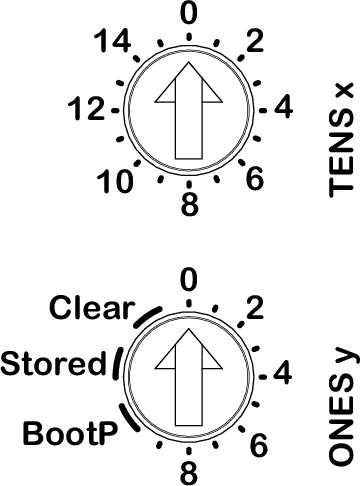

# Overview

The two rotary switches located on the front panel of the Ethernet network interface module are used to set an IP address. Coming out from factory, a network interface module uses the DHCP addressing method by default.

The default positions of the rotary switches are:

* **0** for **TENS x**
* **0** for **ONES y**

NOTE: You can also set the IP address using the Modicon Edge I/O NTS - Web Interface. The Modicon Edge I/O NTS - Web Interface configured IP address is taken into account when the **ONES y** rotary switch is in the **Stored** position.

EIO0000004794.02