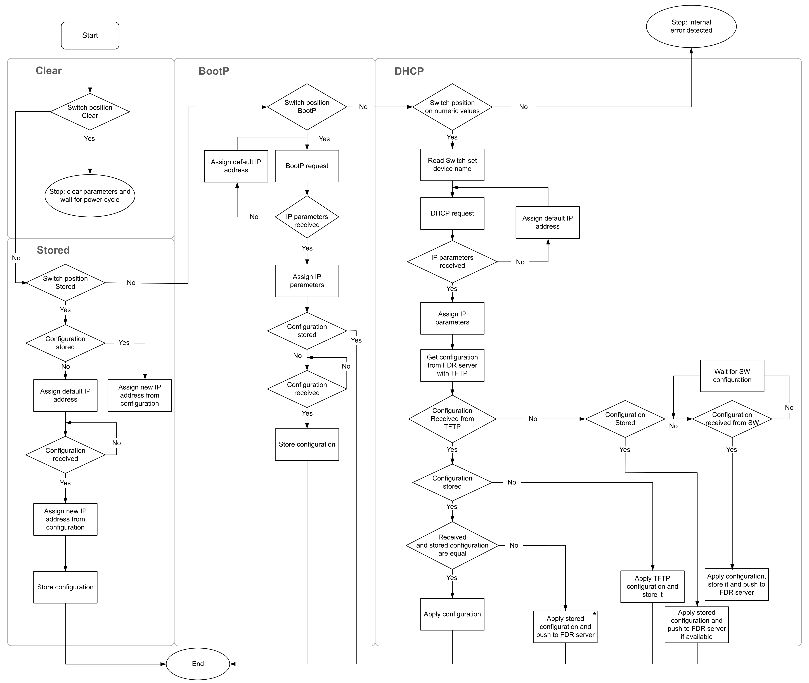

# Applying the IP Address

The device reads the position of the rotary switches at power up.

If communication is not established, verify that the position of the rotary switches is correct. You must do a power cycle to apply the new address setting.

\* For a device replacement with FDR, reset the replacement device to factory settings before applying power to the cluster.

When both Ethernet interfaces are disconnected, the NIM erases the DHCP/BootP configuration. A new DHCP/BootP request is initiated when a new Ethernet interface is connected. The store mode can be used to maintain the IP configuration and to reduce the recovery time.

EIO0000004794.02