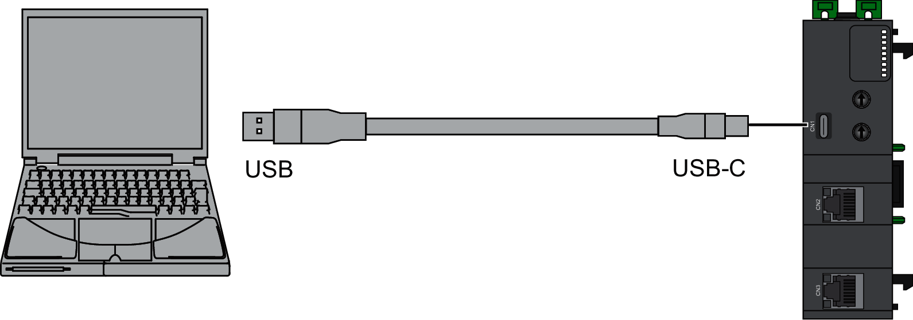

# USB Port CN1 Connection

The USB Port connection is suitable for short-duration connections for the express purposes of configuration, maintenance, and troubleshooting. It is not intended as a long-standing connection for other purposes. Further, the network interface module may only be connected to a PC.

The following illustration shows the USB connection to a PC:

The communication cable should be connected to the PC first to help minimize the possibility of electrostatic discharge affecting the network interface module.

| NOTICE | |
| --- | --- |
|  | INOPERABLE EQUIPMENT  Always connect the communication cable to the PC before connecting it to the network interface module.  Failure to follow these instructions can result in equipment damage. |

To connect the network interface module to the PC, do the following:

| Step | Action |
| --- | --- |
| 1 | Connect your USB cable to the PC. |
| 2 | Connect the connector of your USB cable to the network interface module USB Type-C connector (CN1).  NOTE: A USB Virtual Ethernet Link must be configured on your PC to connect to the network interface module. |

| NOTICE | |
| --- | --- |
|  | INOPERABLE EQUIPMENT  * Always connect a PC directly to the USB port of the network interface module without any intervening device such as a USB port concentrator or hub. * The USB connection is only compatible with a maximum nominal voltage of 5 V between connected devices. * The connection time must not exceed the time necessary to perform configuration, maintenance, and troubleshooting.  Failure to follow these instructions can result in equipment damage. |

EIO0000004794.02