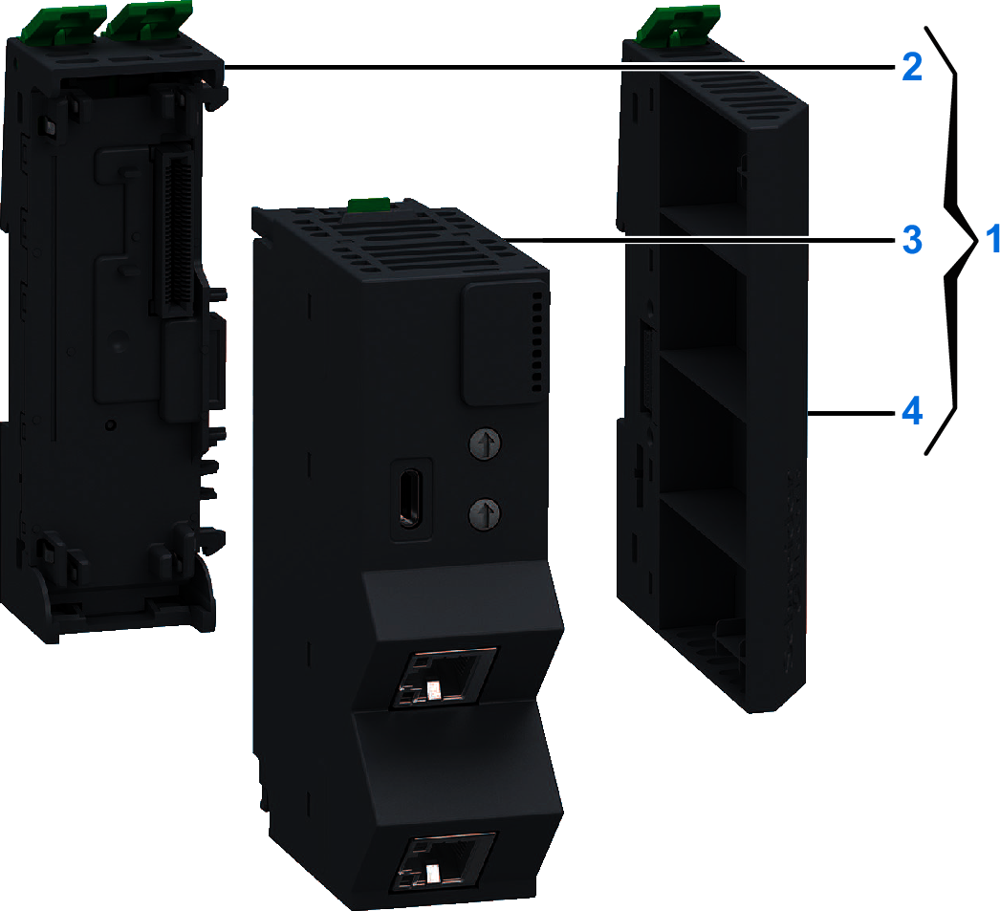

# Purchasing Information

The following figure shows the elements of the Modicon Edge I/O NTS NTSNSC1200 network interface module:

| Number | Reference | Description |
| --- | --- | --- |
| 1 | NTSNSC1200K | Base + module + cluster termination (kit)  NOTE: The module, its corresponding compatible base and the cluster termination can be purchased as a kit. |
| 2 | NTSXBA0201H | Spare Base, 2 Slots, for Network Interface or Bus Extender Module, Hardened |
| 3 | NTSNSC1200 | Network Interface Module, Edge I/O NTS, Sercos III, 100 Mbps, 2 RJ45 |
| 4 | NTSXMP0000H | Spare Cluster Termination, Hardened |

NOTE: For more information on accessories and spare parts, refer to Modicon Edge I/O - System Planning and Installation Guide.

EIO0000004794.02