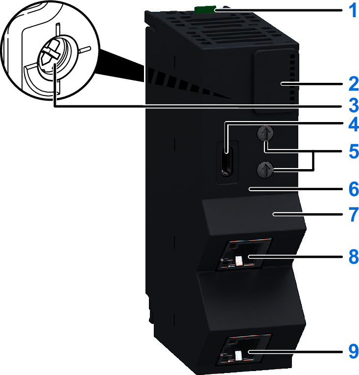

# Physical Description

The following figure shows the elements of the network interface module:

**1** Release button: Use the release button to remove the module from the base.

**2** Status LEDs: Indicates the operational status of the island.

**3** Cybersecurity rotary selector switch: Use this rotary switch to set the Cybersecurity mode.

**4** USB Type-C port (CN1): Use this port to configure and upgrade firmware of the island.

**5** Rotary switches: Use the upper/lower rotary switch to set the Sercos address.

**6** MAC address: This unique 48-bit network ID is hard-coded in the module when manufactured.

**7** Space provided for user labeling.

**8** Sercos III port 1 (CN2): Use this RJ45 port to connect the network interface module to the fieldbus Sercos III network.

**9** Sercos III port 2 (CN3): Use this RJ45 port to connect the network interface module to the fieldbus Sercos III network.

EIO0000004794.02