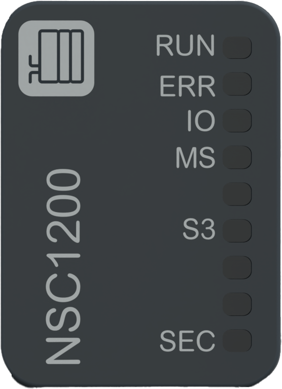

# Status LEDs

The following figure shows the NTSNSC1200 network interface module status LEDs:

The following table describes the status of LEDs during the module initialization mode:

| RUN | ERR | **IO** | **MS** | **SEC** | Description |
| --- | --- | --- | --- | --- | --- |
| OFF | Red ON | OFF | OFF | OFF | Indicates the first initialization step: power supply initialization. |
| OFF | Red Regular Flash | OFF | Red Regular Flash | OFF | Indicates the second initialization step: network interface modules Boot-up. |
| OFF | OFF | OFF | OFF | OFF | Indicates the third initialization step: all LEDs OFF. |
| Green ON | Red ON | ON | ON | ON | Indicates the fourth initialization step: all LEDs ON. |
| Green Regular Flash | OFF | OFF | Red ON | Green Regular Flash | Indicates that the factory reset is in progress. |
| Green ON | OFF | OFF | Red ON | Green ON | Indicates that the factory reset is completed. |
| OFF | Red Regular Flash | OFF | Green Regular Flash | - | No configuration is received.(1) |
| Green Regular Flash | OFF | OFF | Green Regular Flash | - | Indicates that no IP address is configured. |
| Green Regular Flash | OFF | OFF | Green ON | - | Indicates that a valid IP address is configured.(1) |
| Green Regular Flash | OFF | OFF | Red ON | - | Indicates that the firmware is being updated. |
| Green Regular Flash | Red Regular Flash | Orange Regular Flash | Orange Regular Flash | Orange Regular Flash | Indicates that the device identification is ongoing. |
| OFF | Red ON | OFF | OFF | Red ON | Indicates that the advanced mode position is detected but not supported. |
| (1) A valid IP address means a configured IP address (from the configuration or from the Sercos). | | | | | |

The following table describes the status of LEDs during the module configuration mode and IO data communication establishment:

| RUN | ERR | **IO** | **MS** | **SEC** | Description |
| --- | --- | --- | --- | --- | --- |
| - | - | Green ON | - | - | Indicates that the IOBUS data exchange is ongoing. |
| Green Regular Flash | OFF | - | - | - | Indicates that no communication with the controller is established. |
| Green ON | OFF | - | - | - | Indicates that the communication with the controller is established. |
| - | - | - | - | Orange Regular Flash | Indicates that no internal unsecured connection is established. |
| - | - | - | - | Orange ON | Indicates that internal unsecured connections are established. |

The following table describes the status of LEDs during the error detection operating mode:

| RUN | ERR | **IO** | **MS** | **SEC** | Description |
| --- | --- | --- | --- | --- | --- |
| - | - | - | Red Regular Flash | - | Indicates that a position change occurs on rotary switch during operation mode.(1) |
| OFF | Red ON | OFF | Red ON | OFF | Indicates that the power manager unit is in power down mode.(1) |
| OFF | Red ON | OFF | Red ON | Red ON | Indicates a non recoverable detected error. |
| - | - | Red ON | - | - | Indicates that at least one I/O module or Extender module in the island is in error.(1) |
| - | - | Red Regular Flash | - | - | Indicates discrepancies between the configuration and missing or incorrect modules.(1) |
| - | - | - | - | Red Regular Flash | Indicates that a Cybersecurity error is detected. |
| (1) This detected error indicator takes precedence over the actual state, except for the initialization states. | | | | | |

The following table describes the Sercos III (S3) status LED:

| **S3** | Description |
| --- | --- |
| OFF | There is no Sercos communication due to an interrupted or separated connection. |
| Steady orange | The device is in communication phase CP0. |
| One brief green flash followed by steady orange | The device is in communication phase CP1. |
| Two brief green flashes followed by steady orange | The device is in communication phase CP2. |
| Three brief green flashes followed by steady orange | The device is in communication phase CP3. |
| Steady green | The device is in a communication phase CP4 and an active Sercos connection is established without an error detected. |
| Flashing green | The device is in loopback mode and RT-state changes from fast-forward to loopback state.  Loopback describes the situation in which the Sercos telegrams are sent back on the same port on which they were received.  The RT-state change is relevant for Line topology or a break of the ring topology. |
| Flashing red / orange | An application error is detected. |
| Flashing green / red | Describes a Master System Time (MST) interruption. |
| Steady red | A Sercos communication error is detected. |
| Flashing orange | Device identification |
| Flashing red | Describes a watchdog error detection. The I/O system is not running. |

The following graphic shows the system status of LEDs during module operation:

NOTE: For more information on the activities and connectivity of each associated LED of the Ethernet port, refer to [Status LEDs](SercosIIIStatusLEDs-01C40268.html).

EIO0000004794.02