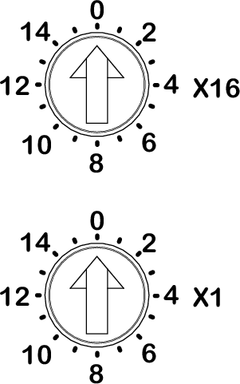

# Overview

The two rotary switches located on the front panel of the Sercos III network interface module are used to set the Sercos address. The address is preset to 0 by default. This way, an automatic addressing is triggered.

The default positions of the rotary switches are:

* 0 for **X16**
* 0 for **X1**

EIO0000004794.02