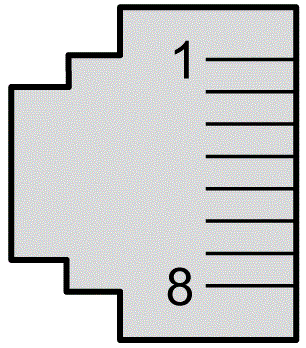

# Pin Assignment

This graphic shows the RJ45 Sercos III connector pin assignment:

The following table describes the RJ45 Sercos III connector pins:

| Pin N° | Signal |
| --- | --- |
| 1 | TX+ |
| 2 | TX- |
| 3 | RX+ |
| 4 | Reserved |
| 5 | Reserved |
| 6 | RX- |
| 7 | Reserved |
| 8 | Reserved |

EIO0000004794.02