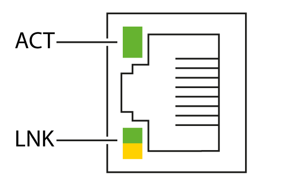

# Status LEDs

This graphic shows the RJ45 connectors status LED:

This table describes the Ethernet status LEDs:

| Label | Description | LED | | |
| --- | --- | --- | --- | --- |
| Color | Status | Description |
| ACT | Ethernet activity | Green | OFF | No activity |
| ON | The link is detected, but there is no activity |
| Flashing | Transmitting or receiving data |
| LNK | Ethernet link/speed | Green/Yellow | OFF | No link |
| Green ON | Link at 100 Mbit/s |

EIO0000004794.02