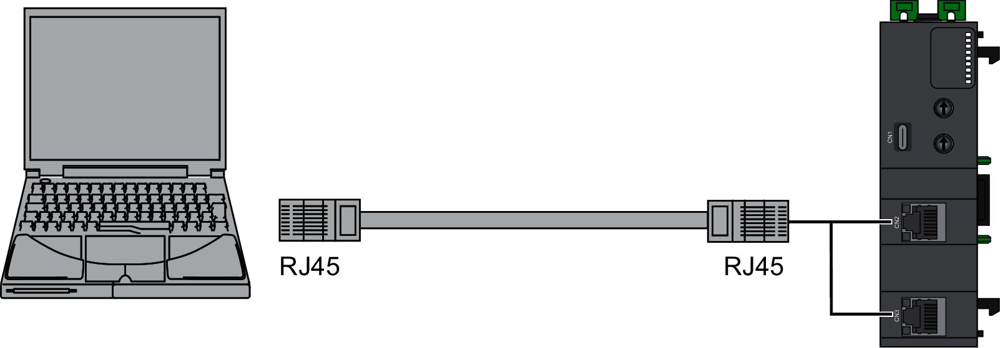

# Sercos III Port Connection

The following illustration shows the network interface module connection to a PC using the Sercos III ports:

To connect the network interface module to the PC, do the following:

| Step | Action |
| --- | --- |
| 1 | Connect the Sercos III cable to the PC. |
| 2 | Connect the Sercos III cable to one of the Sercos III ports on the network interface module. |

EIO0000004794.02