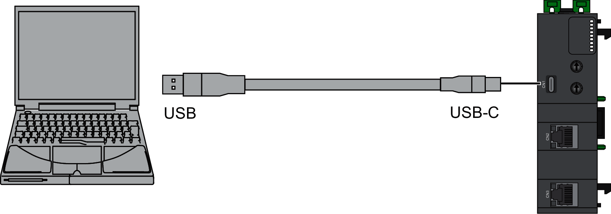
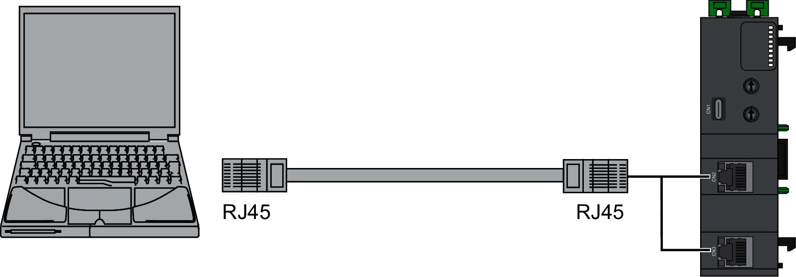

# Connecting the Network Interface Module to a PC

## USB Type-C Connection

The USB Port connection is suitable for short-duration connections for the express purposes of configuration, maintenance, and troubleshooting. It is not intended as a long-standing connection for other purposes. Further, the network interface module may only be connected to a PC.

The following illustration shows the USB connection to a PC:

The communication cable should be connected to the PC first to help minimize the possibility of electrostatic discharge affecting the network interface module.

| NOTICE | |
| --- | --- |
|  | INOPERABLE EQUIPMENT  Always connect the communication cable to the PC before connecting it to the network interface module.  Failure to follow these instructions can result in equipment damage. |

To connect the network interface module to the PC, do the following:

| Step | Action |
| --- | --- |
| 1 | Connect your USB cable to the PC. |
| 2 | Connect the connector of your USB cable to the network interface module USB Type-C connector (CN1).  NOTE: A USB Virtual Ethernet Link must be configured on your PC to connect to the network interface module. |

| NOTICE | |
| --- | --- |
|  | INOPERABLE EQUIPMENT  * Always connect a PC directly to the USB port of the network interface module without any intervening device such as a USB port concentrator or hub. * The USB connection is only compatible with a maximum nominal voltage of 5 V between connected devices. * The connection time must not exceed the time necessary to perform configuration, maintenance, and troubleshooting.  Failure to follow these instructions can result in equipment damage. |

You must configure a virtual Ethernet Link on your USB port, before you can access the network interface module through USB.

To configure a virtual Ethernet Link, configure an Ethernet interface of the USB-RNDIS by following these steps:

| Step | Action |
| --- | --- |
| 1 | Remove power from the network interface module. |
| 2 | Connect the USB cable to the PC and then to the network interface module. |
| 3 | Apply power to the network interface module. |
| 4 | On your PC, set the USB-RNDIS ethernet interface to accept Internet Protocol version 4 (TCP/IPv4). |
| 5 | Set the (TCP/IPv4) IP address and subnet mask of the USB-RNDIS ethernet interface.  For example:   * IP address: 192.168.200.2 * Subnet mask: 255.255.255.0 |
| 6 | In a web browser, enter the USB IP address of your network interface module, by default https://192.168.200.1.  **Result**: The Modicon Edge I/O NTS Web Interface is displayed. |

## Ethernet Port Connection

The following illustration shows the network interface module connection to a PC using the Ethernet ports:

To connect the network interface module to the PC, do the following:

| Step | Action |
| --- | --- |
| 1 | Connect the Ethernet cable to the PC. |
| 2 | Connect the Ethernet cable to one of the Ethernet ports on the network interface module.  NOTE: Your PC and your network interface module must be on the same network and use the same subnet mask. |

The default IP address of the network interface module is 10.10.MAC5.MAC6. The last two fields (MAC5 and MAC6) in the default IP address are the last two hexadecimal bytes of the MAC address of the port.

The default subnet mask is 255.255.0.0.

EIO0000004810.01